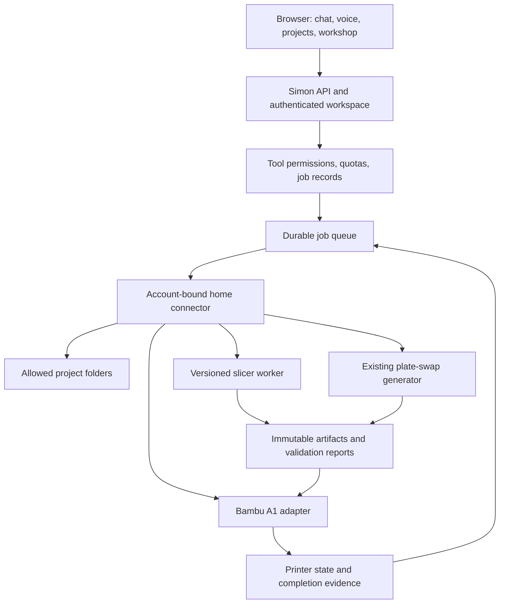

# Simon: accounts, personality, files, and the Bambu A1

> Historical planning and implementation record. Use the [current roadmap](next-phases.md)
> for delivery order and current runbooks for implemented behavior. Dated backlog items below
> may have shipped or moved to RobbinsHome.

This plan separates the features implemented in this phase from the proposed workshop integration. Simon keeps its name. Jarvis mode is a personal communication preset.

Verification: 455 tests passed with PostgreSQL and browser checks enabled, at 95.30% coverage; four opt-in paid tests were skipped in the regression run. The live Vesper/Jarvis WebRTC connection test passed separately. Ruff, strict mypy, and production configuration validation passed. Migration 0012 was applied locally, and the existing owner's saved personality was set to Jarvis/Vesper/sir without changing response-mode preferences. Human assessment of the voice's delivery remains to be done.

## Implemented in this phase

### Private accounts

The configured site administrator can create invitations from **Account & access → Accounts**. Each invitation creates a new user and a separate private workspace using the existing household isolation boundary. The recipient visits Simon's login page, enters the one-use code, and registers their own passkey. No email is sent automatically.

The code expires after 15 minutes and is stored only as a hash. Retrying an invitation request does not create another user or reveal the code again. Renewing an invitation invalidates its previous code. Once a passkey is registered, the web administrator cannot issue another enrollment code for that account. Account recovery remains a local operator action.

The administrator can disable an invited account, revoking its sessions and rejecting further sign-in. Re-enabling preserves its passkeys, conversations, and preferences; it requires a fresh sign-in. Owning an invited workspace does not grant site administration. `SIMON_ACCOUNT_ADMIN_ACTOR_ID` identifies the site administrator; its default is the existing local development user's ID. Migration 0012 adds managed-account metadata without changing existing memberships or moving existing conversations/devices.

New accounts cannot access your existing home inventory, Google connection, conversations, memories, or personal preferences. They can connect their own Google account using the existing OAuth flow. Home-provider credentials remain server environment settings bound to your configured home workspace. Per-workspace LIFX/Tuya credentials and remote home connectors are planned below. Existing shared-household memberships retain their current sharing behavior; this phase does not silently revoke them or make their shared conversations private.

Invited users currently use the server's OpenAI billing. Admission is limited to 25 invited accounts, and existing voice/model limits still apply. Those limits are not monthly budgets. Keep invitations limited to trusted users until per-account quotas and spend reporting are added. There is no public self-signup or sharing invitation UI in this phase.

### Personality and voice

Open **Personality & voice** in chat. The preset, preferred address, voice, and additional instructions are saved for the signed-in user in the current workspace. Response-mode changes preserve these preferences, and concurrent changes are version-checked. New chat requests snapshot the resulting prompt; voice calls snapshot the selected personality and voice at startup. Start a new call to change its voice.

The initial Jarvis mode is calm, analytical, formal, concise, and occasionally dryly witty. It uses a subtle British cadence and addresses the user as “sir” unless a different address is configured. Proactivity means useful suggestions within the current request; tool permissions and any standing automation authorization are enforced separately. The editable guidance field supports a more complete personality later. The preset is a style direction, not a claim to reproduce the film performance.

Vesper is the selected built-in voice for this preset. Official documentation describes its British regional influence and masculine presentation; accent fidelity is not guaranteed. Speech style is prompted separately from the voice selection. [OpenAI voice options](https://developers.openai.com/api/docs/guides/live-conversations), [OpenAI personality prompting](https://developers.openai.com/api/docs/guides/live-prompting).

## Proposed application layout

```text
Simon
├── Chat                         text + live voice + task results
├── Home                         rooms, devices, scenes, power
├── Projects                     project folders, files, versions, artifacts
│   └── Project detail           Files | Activity | Print jobs
├── Workshop                     Bambu A1 status, queue, print history
│   └── Printer detail           Status | Jobs | Plate changer | Profiles
├── Automations                  routines, conditions, run history
└── Settings
    ├── Account & access         private workspace, invitations, sessions
    ├── Personality & voice      presets, address, custom guidance, voice
    ├── Connections              Google, home providers, local connectors
    └── Permissions & usage      shared access, allowed folders, budgets
```

Only Chat, Home, account controls, connections, memories, and Personality & voice exist today. The remaining navigation describes the proposed UI. On a phone, Chat/Home/Projects/More can become bottom navigation; the active voice control stays within reach. Project artifacts and printer receipts should be accessible from the conversation that created them.

## Proposed execution architecture



Initially the API, database, connector, and workers can run on your home server. Define the connector boundary now so the API can move to hosting later without moving printer or filesystem access away from home. A connector registers to one workspace with a revocable credential and explicit capabilities. Its outbound connection carries scoped jobs; a browser never chooses a machine address or local executable. A different user's connector operates in that user's workspace.

## Filesystem phase

Start with a dedicated project root on the home server, for example `C:\SimonData\workspaces\<workspace-id>\projects`. Additional folders are explicit grants with read or read/write permissions. Your home directory and all drives are not automatically exposed to other accounts.

Proposed tools:

| Tool                                       | Behavior                                                               |
| ------------------------------------------ | ---------------------------------------------------------------------- |
| `projects.create`                          | Create a named project and its standard folders                        |
| `files.list`, `files.search`, `files.read` | Bounded reads within granted roots                                     |
| `files.write`, `files.patch`               | Save changes with expected file hashes and a recoverable prior version |
| `files.move`, `files.rename`               | Move within the same authorized root with collision checks             |
| `files.trash`, `files.restore`             | Recoverable deletion and restoration                                   |
| `artifacts.register`                       | Register an immutable output, hash, MIME type, and provenance          |

Resolve file IDs to authorized roots on the server. Check Windows drive-relative paths, UNC paths, alternate data streams, junctions/reparse points, symlinks, and case handling. Protect against path replacement between validation and opening, rather than relying only on a string-prefix check. A downloaded file, document, or README is task data and cannot grant new filesystem permissions. Do not read credential stores or `.env` files as conversational context. Reports should identify exactly which files changed.

Creating a project or making an ordinary requested edit should execute directly inside an authorized root. Overwrites use version checks; deletion goes to a recoverable trash. Broad deletion, writing outside a granted root, and launching programs are different capabilities. Begin without an arbitrary shell tool.

Suggested project structure:

```text
<workspace-id>/projects/<project-id>/
├── project.json                 title and metadata; no credentials
├── source/                      original CAD/STL/3MF files
├── notes/                       specifications and decisions
├── profiles/                    pinned process/filament/fixture references
├── artifacts/
│   ├── slices/<job-id>/         print artifact, preview, estimates, hashes
│   └── plate-swaps/<job-id>/    generator output and validation report
├── runs/<run-id>/               redacted logs and execution receipts
└── .history/                    previous file versions
```

Workspace bindings and permissions belong in the database, not editable project metadata. Uploaded 3MF archives need size limits, safe extraction, and no automatic execution of bundled scripts. Slicers and generators run under a constrained worker account with fixed commands, bounded runtime/output, and no inherited provider credentials.

## Bambu A1 and slicing phase

First establish the A1 firmware version, enabled connection mode, current slicer/version, nozzle/material profiles, and the plate-changing hardware's behavior. Read printer status before adding writes. The requested plate-changing mechanism is custom; do not assume it is a built-in A1 capability.

Bambu Studio documents command-line slicing, profile loading, and 3MF export. Wrap the installed, tested version with typed arguments and pinned profiles; verify its CLI on the actual worker OS. Record source hash, slicer version, printer/nozzle/filament/process settings, output hash, estimates, and warnings. An uploaded 3MF's embedded settings must not silently replace the selected machine profile. [Bambu Studio CLI](https://github.com/bambulab/BambuStudio/wiki/Command-Line-Usage).

Printer transport is a separate adapter. Bambu documents authorization controls, Bambu Connect integration, and an optional developer-mode path for advanced local integration. Availability and operations must be checked against the actual A1 firmware. Do not assume that handing a file to Bambu Connect supports unattended queueing or arbitrary custom G-code. If the supported transport requires a user handoff, expose that state accurately. [Bambu integration guidance](https://blog.bambulab.com/updates-and-third-party-integration-with-bambu-connect/).

## Wrap the existing plate-swap generator

Inspect and reuse your generator's existing motion logic. Put a typed adapter around it with an explicit version, fixed executable/entry point, accepted parameters, timeout, and output contract. The model selects approved fixture profiles and slot IDs; it cannot invent motion sequences, command-line switches, or arbitrary executable paths.

Separate preparation from execution:

1. `plate_swap.prepare`: run the generator with a validated hardware profile; return a G-code artifact, hash, generator version, parameters, required printer state, and validation report. Generating a file causes no printer motion.
2. `plate_swap.validate`: check the approved command subset, motion envelope, speed/temperature limits, profile compatibility, and required start/end conditions. Validation cannot establish that a physical plate is actually seated.
3. `plate_swap.execute`: dispatch the exact validated artifact under a printer lease and the user's job/routine authorization. Persist a dispatch claim before sending it.
4. `plate_swap.verify`: require the configured completion and plate-presence evidence. A transport acknowledgement or generator exit code alone is not completion. If the hardware has no reliable feedback, pause for manual verification.

The former proposed plate-swap manifest was a contract sketch. Physical integration now belongs to RobbinsHome; see [repository separation](architecture/repository-separation.md). The generator location, language, parameters, fixtures, and available sensors still need to be inspected.

## Automation phase

Automations will be full durable workflows with scheduled steps, condition monitoring, branches, recovery, and a visible run timeline. The [workflow automation plan](https://github.com/cam40419/RobbinsHome/blob/main/docs/workflow-automation-plan.md) defines their execution model, scheduling policies, UI, and acceptance checks. Its delivery sequence moves the workflow foundation ahead of printer execution; the sequence below describes the subsystem dependencies rather than requiring the scheduler to wait for the A1 integration.

```text
Requested → Validate files/profiles → Slice → Review or standing authorization
  → Printer ready → Upload → Printing → Completion verified
  → Cool/park according to fixture profile → Plate swap → Plate seated verified
  → Next queued print, or Done
```

Persist each transition, its inputs, and its result. One execution lease owns a printer at a time. Before dispatch, revalidate account access, connector binding, artifact hash, printer readiness, and the selected routine's limits. A saved routine can authorize a bounded batch without repeated chat confirmations; its printer, profiles, quantity, time window, and plate-swap behavior must be explicit.

Read/status operations may retry. After an uncertain motion or print-start response, reconcile printer state before any retry. A server restart must not replay an unknown plate swap. Missing feedback, a disconnected printer, unexpected state, or a failed swap pauses the queue and records what needs attention. A voice call ending does not itself cancel an independently authorized print job. “Stop speaking,” “cancel slicing,” and “stop this print” need distinct handling.

## Delivery sequence and acceptance checks

1. **Accounts and personality — this phase:** private invitation enrollment, role isolation, session revocation, editable personality, and per-call voice selection. Test with separate browser accounts and both storage adapters.
2. **Filesystem tools:** register one root, implement project creation/read/write/versioning/trash, and test cross-account and Windows path escapes. Exercise only a disposable project first.
3. **Workshop preparation:** inspect the generator, probe the installed slicer, add artifact storage and offline slicing/swap generation. Golden-output tests must match your existing generator for known fixtures.
4. **A1 integration:** read-only status and transport verification, then one supervised print and one supervised swap using known hardware/profile limits. Record actual completion evidence.
5. **Workshop workflows:** integrate the earlier workflow foundation with bounded batch authorization, per-printer leases, recovery, manual intervention, and notifications. Test timeout, duplicate delivery, restart, revoked account, and failed plate-presence checks before unattended batches. See the detailed workflow plan for the foundation, scheduling, monitoring, and UI milestones.
6. **Multi-user expansion:** encrypted per-workspace provider credentials, connector pairing/revocation, explicit home/project sharing grants, personal-vs-shared conversation controls, and per-account usage budgets.

This phase does not expose the filesystem, run the plate generator, slice a model, upload G-code, or start a print.
