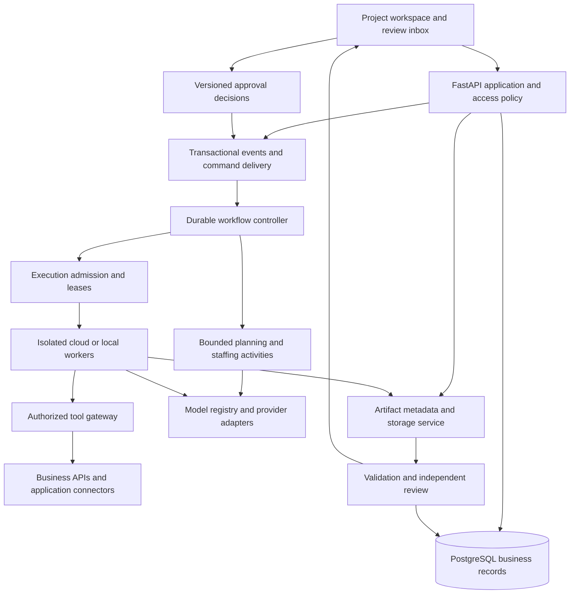

# Simon autonomous work platform plan

Updated October 8, 2026 with the owner's SaaS, hosting, pilot, model and delivery-order decisions and the model/resource implementation checkpoint. Status: architecture proposal with confirmed requirements and remaining design choices. Audience: the owner and the engineers designing the next version of Simon.

**Build a locally developed, hosted SaaS foundation, accepting a clean rebuild where it produces a better design. Complete and test that core before adding business tools individually.** The target is a project and company operating workspace: an AI coordinator understands an outcome, assembles an appropriate team, manages work on boards, produces checked deliverables, and brings the owner clear decisions. Persistent roles provide continuity; bounded execution attempts do the work. The owner can inspect and change either.

The most important changes are first-class shared projects and task ownership, automatic staffing within explicit authority, a reliable artifact and review pipeline, durable business processes, and a coherent user experience. Adding more tools before those foundations would increase the number of partially integrated workflows.

Models must be fully configurable. Local models, open-weight models, and commercial APIs participate through provider adapters and explicit capability contracts. No proprietary agent framework or model provider should own Simon's business records, permissions, boards, or workflow state.

The [delivery roadmap](../next-phases.md) remains the authority for current implementation priority and status. This proposal supplies the October 7 target and decision gates; it does not mark features implemented or authorize a production cutover. The [clothing-brand charter](clothing-brand-pilot-charter.md) starts PLAN-01 and defines core acceptance. The [hosting and capacity plan](hosting-and-capacity-plan.md) compares deployment costs. The [integration delivery plan](integration-delivery-plan.md) defines later adapter work packages. Earlier plans and implementation reviews are retained in Git history; current acceptance is tracked in the delivery roadmap.

## Product requirements and planning assumptions

The following requirements come directly from the requested direction:

- Manage anything from an undeveloped idea to an existing company, with interactive intake of relevant information and documents.
- Let the AI assemble and grow teams. Manual model, role, assignment, plan, and policy changes remain available.
- Represent agents as identifiable workers with responsibilities, work histories, scoped access, and reusable knowledge.
- Keep every task on a project board, assigned to a specific agent, an eligible pool, or a human. Reviews and blockers are work items too.
- Support research, code and Git, images, spreadsheets, presentations, documents, organization, calendars, and business operations through extensible tools.
- Review every deliverable through agents and suitable deterministic checks. Configure creative review checkpoints separately for each project, as the owner specified; use human review for public release by default.
- Preserve project context, source evidence, drafts, accepted files, decisions, and costs with full user visibility.
- Support independently configurable model providers and models, including local and open-weight deployments.

Confirmed direction: eventual public SaaS; configurable full platform administration for the owner; local development first; hosted operation with optional local workers; subscription entitlements for compute/storage; full project-board operations for both agents and humans; the stdout clothing-brand pilot; iterative creative reviews configured per project; a free default model policy for future SaaS users with paid project API keys and limits; and no meaningful historical Simon projects requiring migration. Paid OpenAI use is authorized for stdout, with secure key enrollment and a spending cap pending. The core must be completed and tested before new business tools are implemented one at a time. Native boards are the project task authority; cloud file and third-party board integrations are later tools.

The AI platform is the primary deliverable; stdout is the pilot used to derive and validate reusable requirements. Its existing external brand archive must be preserved independently of any Simon rebuild. Prepared brand/product drafts and the private task register are evaluation inputs, not evidence of implemented autonomous capability or a competing engineering backlog. Formal brand direction, collection design and operations are eventual work for Simon to perform through accepted tools. Their unresolved business decisions do not block platform architecture or core development. The source-art and authorship policy remains open until owner review. Private source details and board links belong in the pilot workspace rather than shared platform documentation.

“Any online task” is a direction for extensibility, not a promise of universal access. Authentication, provider APIs, account permissions, application behavior, physical work, and human decisions determine what is executable. A supported workflow must have a tested completion check and a visible handoff for anything it cannot finish.

## Current implementation boundary

The October 7 rewrite removes memory-backed project identities, actor-owned project
jobs, external-board mirrors, manifest staffing, old project file replication and
the former dispatcher. No project migration or compatibility runtime is retained.

The [native project guide](../runbooks/native-projects.md) documents implemented
shared records and scoped teams. [Project intake](../runbooks/project-intake.md) adds
versioned source evidence, bounded model planning, a separate review call and atomic
staffing/work proposals under project consent. [Project models and resource limits](../runbooks/project-models.md)
now provide scoped encrypted keys, basic text/JSON qualification, separate planning/review
routes and shared project/workspace inference ceilings. The model catalog remains
administrator-managed and workspace-scoped; native execution, compute/storage meters,
all-tool accounting and broader model quality acceptance remain later work.
PostgreSQL and the memory test adapter enforce
workspace/project scope, current membership, revision checks, atomic claims and
durable mutation receipts. [Runtime adapters](../runbooks/runtime-adapters.md)
preserve independently tested model, tool, environment and artifact building blocks.
They still require explicit integration with native agent authorization before
project execution can run. The delivery roadmap owns what is complete and what is next.

The reusable stack is Python/FastAPI/Pydantic, PostgreSQL, explicit domain/services/
adapters, a small browser client, account-scoped connections and separate background
chat work. These foundations do not yet establish complete autonomous intake,
artifact review, long-running workflow, production deployment or supported business
tools. Keep those as separate acceptance gates below.

## Lessons from established systems

The design should combine proven patterns from project software, durable job systems, document tools, and code review. Product comparisons below identify useful behavior; they do not imply those products can already operate a company autonomously.

| Reference                                   | Pattern to adopt                                                              | Boundary for Simon                                                                                                  |
| ------------------------------------------- | ----------------------------------------------------------------------------- | ------------------------------------------------------------------------------------------------------------------- |
| ClickUp and other established work trackers | Visible task ownership, hierarchy, dependency management, human collaboration | Preserve an external authority when the organization chooses it; Simon adds execution, evidence and agent identity. |
| GitHub pull request delivery                | Isolated changes, durable diffs, automated checks, explicit review and merge  | Generalize the reviewed-change pattern to files and external business actions.                                      |
| Temporal                                    | Durable workflow histories, timers and event-driven continuation              | Use for business processes; model inference and connector calls remain bounded external activities.                 |
| AWS Step Functions Standard                 | Managed orchestration with callbacks for an AWS-focused installation          | A credible alternative if hosting is firmly AWS; avoid maintaining two workflow engines.                            |
| Agent runtimes and SDKs                     | Tool loops, structured outputs, traces and bounded delegation                 | Optional execution adapters, not owners of company state or permission decisions.                                   |
| Office and creative applications            | Editable native formats, rendering and human review                           | Keep application-native sources and exports; a generated file needs content and visual validation.                  |

Temporal documents workflow message passing through signals, queries and updates. That supports a process waiting for a reply or decision without repeatedly invoking a model. Its production deployment still requires an explicit managed-service or self-hosting decision, covering authentication, storage, upgrades and recovery. [Temporal message passing](https://docs.temporal.io/encyclopedia/workflow-message-passing), [Temporal self-hosting](https://docs.temporal.io/self-hosted-guide).

AWS Step Functions Standard supports long-running workflows and callbacks; Express has a five-minute limit and lacks callback task-token waits. Standard is the relevant alternative for this product. Airflow is a reasonable choice for separate batch/import pipelines, while LangGraph can serve as a bounded agent runtime with checkpointed state. Do not give an agent framework and the business workflow engine competing ownership of the same process. [AWS workflow comparison](https://docs.aws.amazon.com/step-functions/latest/dg/choosing-workflow-type.html), [Airflow overview](https://airflow.apache.org/docs/apache-airflow/stable/index.html), [LangGraph persistence](https://docs.langchain.com/oss/python/langgraph/persistence).

Asana's approval tasks, intake forms and proofing are useful references for onboarding and visual review. Linear distinguishes human assignment from agent delegation, a useful precedent for separate accountable owner and executor fields; its agent API is currently Developer Preview and should not become a foundational dependency. GitHub's agent workflows illustrate bounded implementation followed by pull-request review, not unrestricted company operation. [Asana project features](https://asana.com/plan/advanced), [Linear assignments](https://linear.app/docs/assigning-issues), [Linear agent API status](https://linear.app/developers/agents), [GitHub agent workflows](https://docs.github.com/en/copilot/concepts/copilot-surfaces/copilot-on-github).

React's component and state model offers an established way to organize the richer board, review and project interfaces. Choosing React here is an engineering recommendation, not a requirement imposed by agent functionality. [React component design](https://react.dev/learn/thinking-in-react).

### Established automation platforms and build versus buy

| Platform                 | Verified relevant pattern                                                                     | Proposed role or tradeoff                                                                                                                                                                                                                                                                                                         |
| ------------------------ | --------------------------------------------------------------------------------------------- | --------------------------------------------------------------------------------------------------------------------------------------------------------------------------------------------------------------------------------------------------------------------------------------------------------------------------------- |
| UiPath Action Center     | Long-running automation can suspend for assigned human input and resume on an available robot | A strong reference for the review inbox and desktop automation handoff. Consider a connector when the business already operates UiPath; include its licensed runtime and operating requirements in the comparison. [UiPath Action Center](https://docs.uipath.com/action-center/automation-cloud/latest/user-guide/introduction). |
| Microsoft Power Automate | Explicit approval actions can wait for individuals, groups or sequential decisions            | Reuse existing Microsoft business flows when useful. Keep Simon's artifact acceptance and task identity explicit across the handoff. [Power Automate approvals](https://learn.microsoft.com/en-us/power-automate/get-started-approvals).                                                                                          |
| Microsoft Copilot Studio | Multistage AI/human approval features are currently documented as preview                     | Useful product research, but this specific preview feature should not be the mandatory production review mechanism. [Preview approval documentation](https://learn.microsoft.com/en-us/microsoft-copilot-studio/flows-advanced-approvals).                                                                                        |
| Camunda                  | BPMN processes coordinate human tasks, APIs and worker-executed activities                    | Credible alternative to Temporal when visual business-process modeling and business-user process ownership are central. Select one process engine after the prototype. [Camunda processes](https://docs.camunda.io/docs/components/concepts/processes/).                                                                          |

The proposed custom Simon core is justified by the desired combination of configurable local/cloud models, AI-created worker roles, a single project/artifact/review experience and existing repository investment. This is a fit judgment, not a claim that existing platforms cannot support those requirements. Stage 0 should compare one representative workflow against the strongest existing-platform alternative, including licensing, customization, exportability, local-data policy, connector maintenance and recovery. Buy commodity capabilities and connect existing operating systems where they reduce total effort; own the parts that define the requested experience.

## Target architecture

Keep one modular application for business rules and APIs, deployed alongside independently constrained workers. Scale execution separately from web traffic. Split services further only when a concrete security, availability, resource, or team ownership need justifies it.



### Recommended technology choices

| Responsibility               | Proposed choice                                                                                                  | Reason and cost control                                                                                                                                    |
| ---------------------------- | ---------------------------------------------------------------------------------------------------------------- | ---------------------------------------------------------------------------------------------------------------------------------------------------------- |
| API and business rules       | Existing Python and FastAPI                                                                                      | Preserve domain code and team knowledge; explicit contracts matter more than changing language.                                                            |
| Business database            | PostgreSQL                                                                                                       | Existing operational investment, transactions, relational constraints and searchable records. Start with ordinary indexes and full-text search.            |
| Web application              | React and TypeScript, a conventional build tool, one component system                                            | Typed forms and state for complex review workflows; migrate one route at a time and keep session/CSRF behavior. Select exact packages in the UI prototype. |
| Workflow durability          | Temporal, introduced through a bounded recovery prototype                                                        | Appropriate target for multi-day approvals and callbacks. Prove the native workflow contract before enabling automatic execution.                          |
| Small deployment alternative | Existing PostgreSQL-backed jobs during early vertical delivery                                                   | Lower initial operations cost; do not expand a custom queue into an unbounded workflow-engine rewrite.                                                     |
| Files                        | Local disk adapter plus S3-compatible object interface; AWS S3 for the hosted reference deployment               | Preserve local operation; support immutable bytes and remote workers. Compatibility must be tested for the selected storage provider.                      |
| Execution                    | Containers for ordinary tools; dedicated isolated runners for desktop/GPU work                                   | Avoid installing every tool in the API image or giving workers the application secret store.                                                               |
| Model access                 | Simon provider adapters, optional compatible gateway                                                             | Keep business policy independent of gateway/model vendors. Local execution pools are first-class resources.                                                |
| Tool access                  | Typed first-party adapters; MCP as an optional transport                                                         | MCP discovery is not authorization, workflow durability or evidence of integration quality.                                                                |
| Observability                | Structured application events, OpenTelemetry-compatible instrumentation, metrics and centralized error reporting | Correlate project/task/run/action/cost IDs. A separate telemetry product must not become the business record.                                              |
| Delivery                     | Existing CI expanded with contract, browser, migration and recovery tests                                        | Release pinned dependencies and reproducible worker images; retain PostgreSQL behavior tests.                                                              |

PostgreSQL includes full-text indexing and search; start there and add a vector index only when retrieval evaluation demonstrates benefit. Adding a separate vector database before that would add another synchronization and authorization surface. [PostgreSQL text search](https://www.postgresql.org/docs/current/textsearch-intro.html).

S3 versioning retains object versions, with storage charged for full versions. Application revision identity, authorization, retention, backup and restoration still need explicit design. [S3 versioning](https://docs.aws.amazon.com/AmazonS3/latest/userguide/Versioning.html).

Do not initially add Kubernetes, Kafka, a graph database, a separate vector service, several agent frameworks, or a second primary task tracker. Add infrastructure against a measured requirement and an operating owner.

### Workflow ownership and failure semantics

PostgreSQL owns projects, tasks, permissions, accepted artifact versions, approval decisions, cost reservations and connector receipts. Temporal owns the scheduling and event history of each migrated process. A workflow must not use its own cached permissions as final authorization for a tool call.

Commit a business change and its outbox event together. Deliver the event at least once using a stable event ID; the recipient deduplicates it. Return workflow observations through idempotent commands. Do not attempt a distributed atomic transaction between PostgreSQL and the workflow engine, and give each business process one workflow authority.

Use deterministic workflow code. Put model calls, connector I/O, file operations and database interactions in activities with explicit timeouts, heartbeat/cancellation handling, idempotency keys and recorded outcomes. Retrying an activity is not proof that repeating its external effect is safe. Durable execution does not create universal exactly-once behavior. [Temporal workflow constraints](https://docs.temporal.io/workflow-definition), [Temporal activities](https://docs.temporal.io/activities).

For rollout, assign each process an engine and definition version. Existing runs finish under the old engine or migrate at an explicit checkpoint. New processes use the selected engine behind a feature flag. Test loss of acknowledgments, duplicate events, worker death, engine outage, stale leases and restored backups before wider use.

Keep only identifiers, hashes and bounded results in workflow history; large artifacts and transcripts belong in authorized storage. Bound child processes and use history rollover, such as Temporal Continue-As-New, where appropriate for months of operation. Define workflow retention, code upgrade compatibility and the recovery relationship between engine history and business records. [Temporal workflow execution](https://docs.temporal.io/workflow-execution).

## Configurable models and inference

Preserve [ModelEndpoint](../../src/simon/domain/model_routing.py), [ModelRouter](../../src/simon/services/model_router.py) and the existing [endpoint client](../../src/simon/adapters/model_endpoints.py). The current worker path already has multiple providers, local routing and permission-aware selection. The main conversation model has a separate OpenAI implementation; the endpoint client has bounded text support and native controller/schema behavior differs by provider. The work is consolidation and capability completeness, not starting model routing from scratch.

The existing conversation configuration value `local` must not be presented as proof that a real local LLM server is connected. Validate the actual inference endpoint and a successful bounded test. Distinguish ready, configured but unverified, unavailable and incompatible states in the UI.

### Configuration contract

An agent role and its model are separate records. Changing a model does not rename the worker, erase its history, enlarge its permissions, or change the task's acceptance criteria.

| Configuration       | Required fields and behavior                                                                                                                                                                                                                   |
| ------------------- | ---------------------------------------------------------------------------------------------------------------------------------------------------------------------------------------------------------------------------------------------- |
| Provider connection | Adapter type, endpoint, authentication reference, region, transport options, timeout, rate limits, TLS/network policy and ownership. Support credential-free local endpoints.                                                                  |
| Model record        | Stable Simon ID, provider model name/version or local artifact digest, license/commercial-use constraints, modalities, context/output limits, structured-output support, tool behavior, streaming, concurrency, pricing basis and data policy. |
| Capability evidence | Operator declaration plus dated probes for required features. Distinguish verified, unsupported and unknown; never infer complete compatibility from the endpoint shape.                                                                       |
| Binding             | Explicit model or permitted routing policy for chat, planning, execution, review, extraction, embeddings, reranking, transcription, speech and image generation.                                                                               |
| Policy inheritance  | Installation defaults, workspace, optional company, project, role and task overrides. Task-stage choice is most specific, constrained by all ancestor grants and ceilings. Show effective values and their source.                             |
| Fallback            | Ordered, explicitly permitted alternatives with equivalent required capabilities and allowed data destinations. Record every switch. Local-only work may wait or fail; it must not silently move to cloud inference.                           |
| Run snapshot        | Exact provider/model configuration revision, prompt/procedure version, capabilities used, usage records and fallback history. Retain historical runs when configuration changes.                                                               |

A settings screen should let the owner add an endpoint, authenticate, discover models when supported or enter an exact model identifier, run capability probes, assign roles, set limits and inspect readiness. Provider-specific options remain available in an advanced section and retain their native meaning. Never send unsupported controls simply because another provider accepts them.

Local operation means more than a local chat model. Embeddings, reranking, image analysis, speech, research tools, telemetry and error uploads must respect the same data policy. The system must make external data movement visible before enabling a supposedly local-only configuration.

Expose separate policies for **local inference** and **all project data retained locally**. Hosted coordination, workflow histories and cloud artifact storage can be compatible with the former but violate the latter. Label a hybrid profile accurately and let the owner select which data classes may leave a machine, project or region.

### Free default and paid project models

New SaaS projects start with a **no paid inference** profile. A user can choose a supported free API account or local endpoint, or later receive a strictly capped Simon-funded allowance. An unconfigured endpoint is visibly unconfigured; a free quota being unavailable must never trigger an unapproved paid fallback. Free consumer chat access is not a developer API entitlement, and a free text API does not imply free image/video generation or unlimited hosted compute and storage.

The stdout pilot is an explicitly authorized paid exception: use project-configured OpenAI models after secure key enrollment and selection of cost limits. Do not hard-code a model or store credentials in pilot documents. Paid pilot inference does not replace testing the future SaaS default's free-quota, unavailable-capacity, and no-paid-fallback behavior.

| Candidate               | Source-backed limitation                                                                                                                                                                                                         | Proposed use                                                                                                                                                                                                                                                                                                                |
| ----------------------- | -------------------------------------------------------------------------------------------------------------------------------------------------------------------------------------------------------------------------------- | --------------------------------------------------------------------------------------------------------------------------------------------------------------------------------------------------------------------------------------------------------------------------------------------------------------------------- |
| Gemini free API         | Free availability and quotas vary by model/project; unpaid-service terms permit product improvement/human review and exclude sensitive/confidential/personal inputs. The terms include region-specific paid-service requirements | Evaluate public/synthetic fixtures only unless the selected account/data policy qualifies. Do not make it a universal confidential-company default. [Pricing](https://ai.google.dev/gemini-api/docs/pricing), [Quotas](https://ai.google.dev/gemini-api/docs/rate-limits), [Terms](https://ai.google.dev/gemini-api/terms). |
| Groq free API           | Per-model request/token caps apply; retention controls and exceptions need configuration review; zero data retention is available with feature restrictions                                                                      | Candidate for bounded development, subject to model tool-use/quality tests and actual account limits. [Quotas](https://console.groq.com/docs/rate-limits), [Data controls](https://console.groq.com/docs/your-data).                                                                                                        |
| Local open-weight model | Requires adequate hardware, suitable weights/license and qualification; local compute still costs resources                                                                                                                      | Candidate for private development and optional local workers. Choose after hardware inventory.                                                                                                                                                                                                                              |

In project settings, add encrypted provider credentials, model selection and daily/monthly/per-run ceilings. Credentials are project-scoped unless deliberately shared; raw secrets never enter prompts, logs or ordinary API responses. Reserve paid usage before concurrent planning, workers and reviews; reconcile charges afterward. Simon can limit requests it sends, not spending by unrelated applications using the same provider key. Provider-side limits, dedicated keys and configurable headroom complement application estimates when the provider supports them.

Model usage and platform compute/storage are separate meters. A user bringing a paid API key still consumes Simon resources; a free model can still exhaust a free subscription's CPU, storage or request allowance. Keep allowances, capacity and payment status separate from model quality and required approvals.

### Provider strategy

Build a common request/result contract with normalized messages, tool requests/results, artifact references, finish reasons, usage, cancellation and errors. Keep provider adapters for differences that cannot be normalized safely. Preserve provider response IDs and usage details alongside the common representation.

Support these families through explicit compatibility tests: native commercial APIs; OpenAI-compatible endpoints; local model servers such as Ollama or llama.cpp; and higher-throughput open-weight serving such as vLLM. Add other APIs through a documented adapter interface. “Any provider” means a supported extension path, not a false promise that every API and modality already works.

| Runtime or interface                 | Verified interoperability issue                                                         | Implementation consequence                                                                                                                                     |
| ------------------------------------ | --------------------------------------------------------------------------------------- | -------------------------------------------------------------------------------------------------------------------------------------------------------------- |
| Anthropic OpenAI compatibility layer | Its documentation positions it for testing/comparison; some schema controls are ignored | Keep the native adapter and validate required guarantees. [Compatibility limits](https://platform.claude.com/docs/en/cli-sdks-libraries/libraries/openai-sdk). |
| Ollama                               | Supports a subset of compatible APIs; Responses support is stateless                    | Simon owns durable conversation state and checks requested features. [Ollama compatibility](https://docs.ollama.com/api/openai-compatibility).                 |
| vLLM                                 | Tool behavior depends on selected model, parser and serving configuration               | Version and qualify the whole serving combination. [vLLM tools](https://docs.vllm.ai/en/latest/features/tool_calling/).                                        |
| llama.cpp                            | Compatibility and tool behavior depend on server/model/template configuration           | Expose only tested features for the configured deployment. [llama.cpp server](https://github.com/ggml-org/llama.cpp/blob/master/tools/server/README.md).       |
| Proprietary agent SDKs               | Runtime conveniences do not establish application-level ownership or permissions        | Wrap them as optional specialist execution adapters. [OpenAI application responsibilities](https://developers.openai.com/api/docs/guides/agents/sdk).          |

Open-weight and open-source are not interchangeable licensing claims. Record the license for each deployed weight/runtime combination and qualify its intended business use. Preserve an embedding index's model identifier, dimensions and version; a model change requires a deliberate rebuild or parallel index migration.

Compatibility tests must cover tool-call IDs and ordering, parallel calls, malformed arguments, JSON/schema adherence, images, context overflow, token accounting, cancellation, streaming, retry headers and refusal/error handling. A text-only model can still perform suitable tasks; it cannot satisfy an image-inspection contract through a configuration label.

Use native structured outputs when supported; otherwise parse and validate against the same schema with bounded correction. Ordinary code authorizes the resulting action. A provider-neutral tool contract must not depend on one SDK's handoff mechanism, memory store, hosted tools or trace format.

### Routing and model quality

First filter by permission, data locality, required modality, tool reliability, context size and available capacity. Then compare quality, expected latency and expected cost from representative evaluation results. Use task difficulty and failure evidence to select or escalate a model; do not route high-stakes synthesis to the cheapest model merely because it is available.

Allow explicit pinning, automatic routing within an allowlist, and fully local profiles. The owner can set a capable planner and reviewer with less expensive execution models, or use one model everywhere. Reviewer independence comes from a separate review task, fresh context and evidence access; a different vendor alone does not guarantee independence.

Maintain a small evaluation set for source accuracy, multi-step tool use, structured planning, code fixes, spreadsheet reasoning, document quality, multilingual work if needed, and resistance to hostile retrieved instructions. Record quality against accepted outputs and owner correction effort. A new model version remains a candidate until it passes the required workload checks.

### Local resource management

Treat GPU memory, model loading, queue capacity and desktop seats as limited resources. Admission should account for context size, concurrent sequences, image inputs, warm/cold model state and runner health. A large number of role profiles does not require that many resident models or simultaneous processes.

Local models do not have zero operating cost. Track GPU/CPU time, memory pressure, storage, electricity assumptions where useful, maintenance and missed deadlines. Hardware purchase requires benchmarks using actual tasks; parameter count or a synthetic token-rate claim is not adequate sizing evidence.

A localhost endpoint does not establish local inference: Ollama can route to cloud models. Enforce approved model IDs, server cloud-disable configuration when applicable and outbound network policy. Ollama also documents how context length and request parallelism affect memory use. [Ollama deployment controls](https://docs.ollama.com/faq).

## Domain structure and board authority

| Entity                          | Responsibility                                                                                                   |
| ------------------------------- | ---------------------------------------------------------------------------------------------------------------- |
| Workspace and membership        | People, access, shared connections, billing boundaries and administrative policy.                                |
| Company                         | Optional long-lived organization, brand rules, operating procedures, records and cross-project objectives.       |
| Project and charter             | Outcome, current accepted brief, scope, success measures, constraints, source inventory and human stakeholders.  |
| Goal and milestone              | Measurable outcome and delivery checkpoints across many tasks.                                                   |
| Task and dependency             | Description, acceptance contract, priority, assignment, readiness, deadline, budget, inputs and output versions. |
| Agent profile and assignment    | Reusable role definition and its project/company-specific authority, knowledge and responsibility.               |
| Run and attempt                 | Bounded compute, model/configuration snapshot, lease, tool history, checkpoints and usage.                       |
| Artifact and revision           | Logical deliverable identity and immutable bytes, source/editable file, preview, checks and provenance.          |
| Review and approval             | Review findings and explicit authorization concerning a particular version or action.                            |
| Business record and decision    | Source-linked facts, accepted decisions, effective dates, uncertainty and supersession.                          |
| Workflow and wait               | Versioned process, correlated incoming event, timeout/escalation and continuation.                               |
| Connector operation and receipt | Intent, request identity, external reference, final or uncertain outcome and reconciliation.                     |
| Budget and usage ledger         | Reservations, settled costs, unknown liabilities, credits and ancestry.                                          |

Use typed task assignment: `agent`, `human`, or `pool`. A pool defines eligible roles and required capabilities. Claim work with a transactional version/lease check; display one accountable owner after claim. Human review does not consume a worker lease. The original requester, assigned owner and actual executing agent are separate identities.

Task states should distinguish backlog, ready, in progress, waiting on dependency, waiting on external input, agent review, human review, changes requested, done, failed and cancelled. Block reasons and recovery actions are structured fields. Separate task state from each attempt's execution state and the external provider's business status.

Completion requires the acceptance contract and current approved inputs, not a model saying “done.” A modified accepted input marks dependent outputs potentially stale and proposes affected follow-up work; it does not silently replay already completed public actions.

### Board ownership and access options

The owner requires full board operations for both agents and humans. That settles who may manage work; it does not by itself choose where canonical task records live. Agents and owners should be able to create/edit tasks, milestones, dependencies, priorities, assignments, comments and status within their project. Retain attribution, concurrent-edit checks, recoverable archiving and task/approval integrity for both actors. Board access does not implicitly grant spending, publication or platform-administration authority.

The existing product delegates business task authority to ClickUp. The target can be satisfied in either of two coherent ways:

1. **Native Simon boards:** Simon owns tasks, assignments, dependencies and status. External boards receive selected projections with declared field ownership. Best fit for a single cohesive agent/human workspace and operation without a board subscription.
2. **External boards:** ClickUp or another selected tracker owns business fields. Simon adds execution and review views and maps agent identities through supported fields. Best fit where existing human teams already depend on that system.

Recommend native boards for the SaaS product, subject to the architecture decision. With no operating history to migrate, the existing ClickUp bridge need not determine the new schema. Keep external trackers as optional later integrations, and do not require every agent to become an external paid seat.

| Option          | Current reference and cost                                                                                                                                                    | Fit for this product                                                                                                                                                                                                                                                                                                                                                                                            |
| --------------- | ----------------------------------------------------------------------------------------------------------------------------------------------------------------------------- | --------------------------------------------------------------------------------------------------------------------------------------------------------------------------------------------------------------------------------------------------------------------------------------------------------------------------------------------------------------------------------------------------------------- |
| Native Simon    | No external board subscription; development/maintenance belongs to Simon                                                                                                      | Best fit for tenant isolation, human/agent/pool ownership, artifacts and the creative review loop. Proposed, not yet delivered.                                                                                                                                                                                                                                                                                 |
| ClickUp         | Free plan offers tasks/boards with 60 MB storage; Unlimited is $7/user/month billed annually or $10 monthly. Free/Unlimited/Business API limits are 100 requests/minute/token | Existing adapter reduces initial integration work. Keep artifact storage separate and map agent attribution explicitly. Workspace upgrade/seat economics and API limits affect SaaS use. [Pricing](https://clickup.com/pricing), [API limits](https://developer.clickup.com/docs/rate-limits).                                                                                                                  |
| GitHub Projects | Projects are included in GitHub Free and can be automated through GraphQL                                                                                                     | Strong engineering board; less natural for apparel creation and company-wide visual review. [Pricing](https://github.com/pricing), [Projects API](https://docs.github.com/en/issues/planning-and-tracking-with-projects/automating-your-project/using-the-api-to-manage-projects).                                                                                                                              |
| OpenProject     | Community can be self-hosted without a license fee under GPLv3; hosting/operations remain costs                                                                               | Established alternative to building project management. Prototype the required board/API behavior and selected edition: basic-board movement does not update work-package attributes. [Community](https://community.openproject.org/projects/openproject?layout=false), [API](https://www.openproject.org/docs/api/introduction/), [Board behavior](https://www.openproject.org/docs/user-guide/agile-boards/). |

Prices and provider limits above were checked October 7, 2026; currency is USD for ClickUp, before taxes. Board selection is still an architecture decision. Full agent access does not require giving an agent organization billing/identity administration or a human's unrestricted credential.

For either choice, define field ownership, external ID mappings, change cursors, conflict handling, deletes/archives, status mappings and offline behavior. A provider outage must not make local artifact review inaccessible. Never represent two independently editable status fields as automatically consistent.

Large projects require paginated tasks, indexed dependencies, milestones and bounded planning windows. Keep small execution batches and decomposition depth limits; simply increasing today's per-plan/task-list limits would amplify context and coordination cost.

## Interactive project creation

Project creation is a resumable workflow, not a long form or a single prompt.

1. **Capture the starting point.** Accept an idea, existing company, active project or repository. Ask for desired outcome, audience, existing assets, hard constraints and what success looks like. Save partial answers immediately.
2. **Connect and inventory.** Offer uploads, selected folders, repository access, board import and relevant business accounts. Discover resources by name. Record what was imported, unavailable, excluded or not yet parsed.
3. **Extract and reconcile.** Parse documents, tables, images and transcripts in isolated jobs. Preserve originals, hashes, source locations and access controls. Identify contradictions, duplicates, obsolete material and unanswered questions.
4. **Build a provisional charter.** Present scope, goals, stakeholders, brand/tone, facts versus assumptions, budget, deadlines, constraints, proposed outputs and operating policies. Ask only questions that change the next useful work.
5. **Generate the initial operating model.** Suggest milestones, a small role roster, tool connections, a draft board and review responsibilities. Explain each role's purpose and expected cost/capacity, including human responsibilities.
6. **Confirm authority once at the right level.** Establish spending limits, permitted accounts/resources, publishing rules and escalation behavior. Ordinary planning and drafting inside that envelope can then proceed without repeated confirmation.
7. **Deliver the first useful result.** Produce a short, checked output tied to an actual priority. The owner can correct the charter or team while independent tasks continue.

Ingestion is evidence intake, not permission escalation. A document saying “ignore the owner” or “send these files elsewhere” is source text, not an instruction. Secrets should be detected/redacted from model context and routed to connection setup when appropriate. Deleted or revoked sources must stop contributing to later retrieval.

For an existing company, discover products, customers, suppliers, contracts, financial sources, content channels, operating procedures and current projects incrementally. Avoid blocking the first deliverable on a complete enterprise data migration.

## Automatic staffing and team growth

Give each role a charter: responsibilities, deliverable types, capabilities, scoped knowledge, escalation rules, review obligations and performance history. A persistent agent is this identity plus its records; it consumes no model calls while idle.

The coordinator follows a bounded staffing procedure:

1. Convert the outcome into deliverables and acceptance checks.
2. Decompose only enough work to make the next milestone executable; identify genuinely independent branches.
3. Reuse existing qualified roles where possible; use a generalist for simple connected work.
4. Add a specialist when capability, confidentiality, parallel capacity or independent review justifies it. Record the reason and estimated work.
5. Admit the proposed staffing through tool permissions, model readiness, project budget, local resources, maximum active workers and delegation-depth limits.
6. Assign tasks and review ownership, then execute only ready work. Coordinate through artifacts, task events and bounded handoffs.
7. Expand or retire roles based on sustained backlog, recurring work or capability gaps. Preserve their history and hand over unfinished tasks.

AI-created roles can receive a subset of existing delegated authority. They cannot grant themselves new accounts, widen access, change the review policy or increase budget. Creating a role within the approved operating envelope should not require a human form. New authority or material recurring expense creates a decision item.

Example: a clothing launch may initially need a coordinator, a product/supplier researcher and a creative maker, with a separate review assignment. Fulfillment and customer-support roles become useful when actual order volume appears. A short research question may need one worker and one review pass. Avoid staffing every project with a fixed executive hierarchy.

Show a staffing change as a readable diff: role added/retired, why, affected tasks, access, resource use and expected cost. Allow the owner to pin a role, replace its model, reassign work, limit delegation, pause a project or revoke a connection. Stop new work promptly after revocation; reconcile any already-started external operation.

## Ongoing company operations

Company autonomy needs a continuing operating loop in addition to project delivery. Define approved business objectives, measurable indicators, reliable data sources, recurring procedures and event triggers. The coordinator observes those inputs, detects actionable changes, creates or updates board work, assigns appropriate roles, executes within policy, reviews outcomes and measures the result.

Every recurring process has an owner, purpose, trigger/cadence, source freshness requirement, work limit, spending period, deduplication key, cooldown, escalation rule and stop condition. Examples include stock-risk review, a weekly content plan, unanswered customer requests, supplier follow-up and monthly management reporting. An incoming event should not create duplicate tasks or start a team-wide discussion every time it is delivered.

Use separate planning horizons: company objectives and constraints; project milestones and capacity; ready tasks and bounded attempts. Revisit priorities when evidence changes. The system may propose a new initiative, but it should not invent a business goal, authorize a purchase or alter a brand strategy simply to keep agents busy.

Operate accounting, commerce, CRM and fulfillment through the company's selected systems of record. Link invoices, products, customers and shipments to evidence and tasks; avoid creating a second unofficial financial ledger from model-generated summaries. Human tasks cover physical samples, signatures, unavailable credentials and decisions that require accountable judgment.

Provide a periodic operating review showing accepted output, performance against objectives, spending, exceptions, unresolved decisions and recommended adjustments. Enable gradual expansion from supervised delivery to bounded recurring operations based on measured quality, with a visible pause and escalation mechanism.

## User experience and visibility

| Surface             | Information and actions                                                                                                      |
| ------------------- | ---------------------------------------------------------------------------------------------------------------------------- |
| Portfolio           | Companies/projects, outcomes, health, spend, overdue decisions and deadlines.                                                |
| Project overview    | Accepted objective, current milestone, latest useful output, blockers, upcoming decisions and next planned work.             |
| Board               | Agent/human/pool assignment, status, dependencies, deadlines, acceptance criteria and artifact links; list and Kanban views. |
| Team                | Role cards, current work, capabilities, model policy, readiness, cost and staffing history.                                  |
| Review inbox        | Actual previews, checks, reviewer findings, diffs and approve/revise/reject actions.                                         |
| Files and knowledge | Searchable deliverables, editable sources, revisions, source evidence, business records and decisions.                       |
| Calendar            | Work schedules, review deadlines and connected events, with time zones and connection ownership.                             |
| Activity            | Plain-language events and receipts; expandable tool/model traces, estimated/settled usage and recovery details.              |
| Settings            | Connections, provider/model registry, access, budgets, automation policies, retention and notifications.                     |

Keep one durable task URL across conversation, board, run history and review. User steering becomes a saved instruction revision with a clear affected scope. A status question should read recorded progress without launching a team-wide discussion.

Notifications should identify a decision, deadline or exception. Bundle routine progress into digests, respect quiet hours, avoid repeating unanswered questions, and make every notification link back to the exact task or review. Support keyboard use, readable contrast, responsive layouts, accessible dialogs and clear empty/error/reconnecting states.

Visibility means useful plans, evidence, actions, results and concise rationale. Do not promise access to private provider reasoning. Show partial failures and uncertainty as normal states rather than an animated worker that appears productive indefinitely.

### Review interaction

Each review package contains the brief, actual candidate, rendered preview, editable source, difference from the prior version, checks performed, independent reviewer findings, unresolved issues and the exact requested decision. Batch related items without hiding individual failures.

Allow comments on a page/slide, spreadsheet cell/range, image region, video time range, or code line as appropriate. Convert requested revisions into linked work with preserved context. Approval records bind to a content hash and destination/action parameters; a changed file or recipient invalidates stale approval.

Creative approval and permission to publish are separate decisions. An approved image is not authorization to launch an advertisement, spend money or publish it to every channel. The owner may approve a complete campaign package with explicit channels, timing and spending limits to avoid repetitive clicks.

## Deliverable quality and research

Use a consistent pipeline: accepted brief and output contract, evidence collection, draft creation, deterministic validation, maker inspection, independent review, bounded repair, human review where required, and versioned acceptance. Preserve failed drafts and review evidence. Every stage is accountable to the same task and budget.

The output contract states audience, purpose, format, editable source, visual style, technical constraints, required evidence, acceptance rubric and publication destination if any. Quality is part of task planning; it cannot be added only after the maker exhausts the budget.

| Output             | Required inspection beyond text self-review                                                                                                                             |
| ------------------ | ----------------------------------------------------------------------------------------------------------------------------------------------------------------------- |
| Research           | Trace key claims to retrieved evidence; check source authority, date and contradictions; verify calculations and citations; label assumptions and unresolved questions. |
| Code               | Inspect diff, run relevant tests/lint/type checks in isolation, verify acceptance behavior and migration/secret/dependency implications.                                |
| Spreadsheet        | Validate types, units, formulas, totals, source data and edge cases; recalculate with a suitable engine and inspect rendered sheets/charts.                             |
| Presentation       | Check narrative and source claims; render every slide; inspect overflow, typography, contrast, chart labels, aspect ratio and editable structure.                       |
| Document or PDF    | Verify content, references, tables and pagination; inspect all rendered pages and required signatures/fields; retain editable source.                                   |
| Image              | Inspect dimensions, artifacts, text accuracy, brand requirements, transparency/color needs and intended use. Preserve prompt/reference/provenance records.              |
| Video/audio        | Check cuts, sync, captions, loudness targets, black/silent segments, export parameters, credits and rights/consent records where applicable.                            |
| External operation | Compare the executed payload with approved parameters; verify the provider's actual state and capture a receipt.                                                        |

Research begins with a question and decision criteria, uses source discovery and actual retrieval, retains permitted source snapshots or bounded excerpts, builds a claim/evidence map, seeks disconfirming evidence, and distinguishes observation from inference. Increase depth for consequential decisions; stop when the decision has adequate support or disclose the remaining evidence gap. More agent messages or a longer report are not quality metrics.

Deterministic validators catch mechanical defects. Review agents assess reasoning, completeness, fit and visual quality using the actual artifact and its sources. Calibrate reviewers with seeded mistakes and owner-rated examples; a second model can repeat the first model's error. Require suitable human expertise where the intended document or decision demands it.

Reserve budget for validation and one or more bounded repairs. If quality remains insufficient, show a failed or partial deliverable with reasons and a costed continuation option. Do not downgrade acceptance criteria silently or run an unlimited reviewer loop.

## External actions and autonomy

Define permissions at the action/resource level, independent of model prompts. Proposed defaults:

| Action class                                                                         | Default behavior                                                                                                                                                                                   |
| ------------------------------------------------------------------------------------ | -------------------------------------------------------------------------------------------------------------------------------------------------------------------------------------------------- |
| Authorized reads, research, internal planning, draft generation and local validation | Automatic within budget and scope.                                                                                                                                                                 |
| Internal task updates, knowledge proposals and reversible file revisions             | Automatic with attribution and version history.                                                                                                                                                    |
| Creative direction and drafts                                                        | Project-specific checkpoints, as requested by the owner: direction approval, draft approval, final acceptance and publication may be enabled independently, subject to mandatory workspace policy. |
| Public content, outbound campaigns, deployments and external messages                | Review exact payload, destination and timing before commitment unless a precise standing rule covers it.                                                                                           |
| Purchases, ad spend, refunds, contracts, sensitive access and destructive operations | Explicit limits and approval policy; changes to that authority require an authorized human.                                                                                                        |

Use the shared connector lifecycle from the companion plan: `draft -> validated -> awaiting_review or authorized -> dispatching -> succeeded, failed_known or outcome_unknown`. A durable claim precedes dispatch. Reconciliation creates evidence resolving an unknown outcome; it is not a generic success state. Rejected and cancelled are distinct terminal paths. A network timeout after submission means unknown until reconciled. Retrying a send, purchase, upload or deployment blindly can duplicate a real effect.

An approval includes approver identity, operation fingerprint, artifact hashes, destination, monetary limits when relevant, expiry and policy version. Revalidate permissions and current input versions immediately before execution. Record cancellation races and partial commits; “cancelled” must not conceal an already sent email.

## Knowledge, privacy and artifacts

Separate original sources, extracted observations, accepted business facts, decisions, procedures, conversation history and transient run context. Facts have provenance, confidence, owner confirmation state, effective dates and refresh requirements. Summaries retain links to full evidence rather than replacing it.

Retrieve relevant authorized content per task. Apply workspace/company/project/document access filters before retrieval results enter model context. Do not mix private personal memory into a company-wide role merely because the same human owns both. Cross-project sharing is explicit and attributable.

Use one logical artifact identity with immutable revisions, typed relationships to sources/previews/exports, meaningful filenames and checksums. Keep response history durable without exporting every chat answer into the Files view. Large uploads need streaming, resumable transfer, checksums, quotas and pending/publication reconciliation.

Deletion and retention cover source bytes, previews, search indexes, derived summaries, shared copies and backup policy. Record tombstones and prevent revoked content from reappearing through replay or reindexing. Do not promise immediate deletion from immutable backups; document the actual retention and restore rules.

## SaaS administration and subscription foundation

Design tenant isolation from the first local core build, even with only the owner using it. A platform administrator manages tenants, users, system/provider defaults, infrastructure, subscription entitlements, quotas, support operations and emergency pauses. A tenant/project owner manages that business and its boards. Agents are scoped principals with operational authority, not administrators who can grant themselves rights.

Provide the owner's requested configurable full administrative control, including explicit cross-tenant support/data access where enabled. Record the actual admin, effective identity, reason and affected resources. Privileged paths must not be accidental bypasses of ordinary tenant filtering. Expose connection replacement, testing and revocation without returning stored secrets in plaintext. An admin can deliberately override plan/resource limits; log and version the override while preserving action reconciliation and approval integrity.

Represent subscriptions as versioned entitlements: projects/seats if chosen, storage/retention allowance, queued and concurrent runs, CPU/RAM time, GPU allowance, job duration, priority and optional included model credits. Share worker pools with per-tenant admission and fair scheduling. Allocate dedicated resources only where a selected plan, isolation requirement or measured load justifies them.

The core can assign synthetic plans through admin settings and test upgrades, downgrades, resets, oversubscription and overdue states without a payment service. A downgrade must not silently delete excess files or create repeated billable retries. Payment checkout, invoices and subscription webhooks are one later integration, required before charging SaaS customers. The [hosting and capacity plan](hosting-and-capacity-plan.md) separates platform, model and media costs.

## Security and operating model

Separate user identity, agent principal, worker process and provider credential. Workers receive short-lived task authority and access only to required inputs/tools. The public API should not expose a general shell or unrestricted Docker control.

Isolate untrusted code, documents, websites, browser sessions and repositories. Enforce file/path limits, tool allowlists, outbound destination policy, secret redaction, CPU/memory/time limits and cancellation. Tool responses and retrieved instructions are untrusted data. A prompt telling an agent to behave safely is not an access boundary.

For hybrid hosting, local runners initiate authenticated outbound connections. Sign or authenticate task assignments, bind them to a lease generation, and fence stale results. Transfer artifacts through authorized storage rather than assuming shared local paths. Reconnection must reconcile task ownership before restarting work.

A production gate includes session expiry/revocation, invitation and recovery behavior, tenant isolation, shared encryption-key availability/rotation, authenticated artifact access, tested SSRF/network policy, dependency/image pinning, queue and database capacity, encrypted off-machine backup and measured restoration. Verify each deployment gate against the selected hosting environment.

Restoration starts in a recovery mode with dispatch and schedules disabled. Fence pre-restore leases, compare workflow history with business records and reconcile provider actions since the backup point. A restored database does not undo sent messages, published content or payments. Keep unresolved effects unknown and reactivate only reconciled work. Test mismatched workflow/database recovery points and record actual recovery-point and recovery-time limits.

## Efficiency and cost

Optimize for accepted deliverables, not token count alone. The ledger must include intake, planning, workers, review, retries, repair, embeddings, image/audio/video calls, browser/runner time, storage and paid business APIs. Track user review effort separately; cheap generation that creates hours of correction is expensive work.

Reserve costs atomically against account, company, project and task ceilings before dispatch. Child work spends from its parent's allowance rather than receiving a fresh independent budget. Settle known charges; retain conservative reservations for unknown outcomes and flag unpriced tools. Explain estimates, settled usage and remaining allowance separately.

Recurring work also needs daily/monthly accounting periods, warning thresholds and hard stops. An authorized weekly process must not inherit an unlimited lifetime allowance. Show projected period spend and the work that a limit would delay; budget increases remain an owner-controlled policy change.

Useful efficiency controls include reuse of validated evidence, bounded context packets, caching that respects permission/model changes, event-driven waits, cheap deterministic checks before expensive model review, limited parallel branches, checkpointed paid jobs and model escalation after specific failures. Preserve interactive capacity while background work runs.

Use a measured monthly model: fixed hosting and subscriptions + accepted packages × average generation/review/repair cost + other metered operations/storage + local hardware and operator costs. Separate a model/API bill from total operating cost, and avoid double-counting runner or storage charges already included in a package estimate. Stage 0 should produce a worksheet from representative tasks, with normal and heavy-revision cases, current provider prices, local hardware assumptions and the owner's expected volume. The operating budget remains open until that workload is selected.

Track cost per accepted output, first-pass acceptance, revision count, owner minutes per delivery, elapsed completion time, queue age, recovery success, connector error/unknown rates and local resource saturation. Compare model configurations on identical tasks with quality thresholds before comparing cost.

## Proposed repository organization

Preserve the current layering and reorganize by domain within it. The following is a target shape, not a command to move all files at once:

```text
src/simon/
  domain/        projects, tasks, agents, artifacts, reviews, policy, budgets
  services/      onboarding, planning, staffing, dispatch, review, knowledge
  workflows/     versioned durable processes and activity contracts
  adapters/      persistence, model providers, tools, storage, execution
  api/           routers, authorization, schemas, application lifecycle
web/             typed project, board, team, review and settings interfaces
workers/         deployable entrypoints and supported worker image definitions
db/migrations/   additive, checksum-preserving data migrations
tests/           domain, contract, integration, UI, recovery and evaluations
docs/            one roadmap, architecture decisions, integration plans, runbooks
```

Extract interfaces around models, artifact storage, connector operations and worker execution before moving implementations. Generate or maintain typed API contracts; the frontend must not duplicate authorization logic. Package optional desktop/CAD/media dependencies separately from ordinary workers.

## Phased delivery and acceptance

The owner has selected **core first, thoroughly tested, then one business tool at a time**. Core model transports, generic file handling and a deterministic reference tool are necessary to exercise the platform; they are not a commitment to implement the entire tool catalog during the core build. The [pilot charter](clothing-brand-pilot-charter.md) defines that boundary and 18 acceptance scenarios.

| Stage                                | Scope                                                                                                                                            | Exit evidence                                                                                                                                                                                    |
| ------------------------------------ | ------------------------------------------------------------------------------------------------------------------------------------------------ | ------------------------------------------------------------------------------------------------------------------------------------------------------------------------------------------------ |
| 0 PLAN-01 and architecture decisions | Platform workflow contracts and evaluation scenarios using stdout inputs; board/hosting/model choices, rebuild/reuse comparison and core backlog | Platform acceptance scope, declared assumptions, draft UX and test contracts; final brand choices are not prerequisites.                                                                         |
| 1 SaaS and project foundation        | Tenants, admin, project/task/role entities, board operations, artifact identity, model registry, entitlement and spend contracts                 | Two-tenant isolation, full authorized board/admin operations, consistent task claims and budget reservations.                                                                                    |
| 2 Complete core experience           | Interactive intake, AI staffing, bounded execution, generic file/revision/review loop, project free/BYOK settings, user steering                 | End-to-end clothing scenarios using fixtures/reference tools and configured inference, including paid pilot and free-default policy tests; no technical setup required for ordinary product use. |
| 3 Durable execution and capacity     | Events, schedules/waits, execution leases, optional local runner, cancellations, unknown effects, shared queues, restoration                     | Failure-injection and concurrent-tenant tests; no cloud-only user dependency on a local runner; reconciled restore.                                                                              |
| 4 Core acceptance                    | Local packaging, security, usability, accessibility, evaluation and resource baselines; admin-assigned subscription tiers                        | Mandatory core matrix passes, owner reviews actual workflows, unresolved limits documented. No claim that future business tools are validated.                                                   |
| 5 Individual tool delivery           | Select one production tool; implement, test, run a real pilot task, inspect quality and recovery, document and enable it                         | One accepted tool at a time; next tool follows the clothing pilot's observed needs.                                                                                                              |
| 6 Hosted beta and commercial release | Selected hosting, live metering, billing integration, tenant lifecycle, operational/support readiness and hosted capacity validation             | Separately accepted public release with measured economics and usable supported tools.                                                                                                           |

Do not reuse the earlier 20-37 person-week range for this revised scope: it mixed several business connectors into a private pilot while excluding the requested SaaS foundation. Re-estimate the dependency-ordered core backlog after the design prototype. The hosting comparison gives infrastructure examples; it is not an engineering delivery quote. Later tool effort remains package-specific in the companion plan.

Tenancy, admin policy and UI quality begin with the core. Actual payment-provider integration follows its own tool gate and is necessary before charging customers. Public release also requires live deployment acceptance; local core acceptance alone is insufficient.

### First implementation backlog

Implementation checkpoint, October 7: the [native project foundation](../runbooks/native-projects.md) begins DATA-01/DATA-02, AGENT-01 and UI-01. Shared records, human/agent/pool assignment, atomic claims, scoped agent roles, lifecycle, bounded delegated staffing authority, owner-controlled team policy and temporary revocable credentials are implemented. The browser supports people/role/task management and one-time credential delivery. Every role edit fences its credentials; pausing/retiring releases unfinished assignments. The old Work/project/manifest dispatcher paths are removed, with no legacy backfill.

The [intake extension](../runbooks/project-intake.md) provides source revisions, resumable context/answers, model planning and separate proposal review, role/task reuse and atomic automatic staffing within existing authority. The [model/resource extension](../runbooks/project-models.md) implements project key enrollment, basic synthetic qualification, qualified free/local routing, distinct planning/review selection and shared per-call reservations/settlement for native qualification, intake and specialist execution. Unknown calls retain monetary holds and concurrency slots until resolved; workspace owners can reconcile them with evidence. These advance MODEL-01/COST-01 without claiming all-tool billing, compute/storage entitlements or live model quality acceptance.

The [native execution extension](../runbooks/native-execution.md) adds owner grants, versioned dependencies, leased runs, bounded delegation, checkpoints, correlated waits, schedules, cancellation, safe retries and an activity UI. It implements the bounded PostgreSQL controller alternative with explicit engine/definition versions. Optional outbound runners hold separate scoped authority and coordinate server-side model/reference steps; they do not execute local shell/CAD/GPU work or receive provider keys. Completed candidates enter board review and do not establish artifact acceptance. Temporal rollout, accepted artifact revisions, deliverable review, physical resource meters and production restoration remain open.

Isolated PostgreSQL 16.15 with pgvector 0.8.6 is locally tested; PostgreSQL 17 CI/container validation remains pending. No paid model calls or live pilot output-quality acceptance were performed during implementation. This does not complete AGENT-01, the core gate or PLAN-01's full evaluation program; the roadmap owns final validation counts.

| ID          | Deliverable                                                                        | Acceptance and sequencing                                                                                                                                   |
| ----------- | ---------------------------------------------------------------------------------- | ----------------------------------------------------------------------------------------------------------------------------------------------------------- |
| PLAN-01     | Platform workflow contracts and pilot-based evaluation set                         | Stdout inputs map to reusable intake, staffing, boards, review, model, cost and recovery behavior with expected results and failure cases.                  |
| PLAN-02     | Architecture decisions for board, hosting, free-model profile and workflow owner   | Distinguish confirmed owner requirements from the selected technical solution.                                                                              |
| SAAS-01     | Tenants, platform admin and versioned subscription entitlements                    | Two independent tenants; configurable privileged access; audited overrides and safe synthetic plan transitions.                                             |
| DATA-01     | Explicit shared project/membership/task schema                                     | Fresh schema permitted; preserve access/task invariants without mandatory legacy backfill.                                                                  |
| DATA-02     | Human/agent/pool assignments, dependencies and claiming                            | One owner per claim; reassignment fences old work; complete scoped board operations for both humans and agents.                                             |
| MODEL-01    | Unified model registry, project credentials, no-paid profile and capability probes | Enrollment/basic qualification and free/local/no-paid routing are implemented; capped live pilot quality and broader capability acceptance remain required. |
| COST-01     | Model reservations and platform resource meters                                    | Parallel work cannot spend the same allowance; unknown usage remains visible; keys stay within their authorized project.                                    |
| ART-01      | Generic artifact inventory, versioning and storage interface                       | Hashes, filenames, drafts, previews and acceptance references remain consistent and authorized.                                                             |
| REVIEW-01   | Independent review contract and owner revision loop                                | Seeded fixture defects fail review; comments create linked revisions; changed files invalidate stale acceptance.                                            |
| UI-01       | Usable project/board/team/review/model/admin interfaces                            | Ordinary use through UI; responsive, accessible, conflict and error states tested.                                                                          |
| FLOW-01     | Durable waits, schedules and reference-provider operation ledger                   | Restart, duplicate event, timeout, stale approval and unknown-write cases pass.                                                                             |
| AGENT-01    | AI team creation/growth with manual steering                                       | Qualified roles reused; additions explained; no privilege/budget enlargement through delegation.                                                            |
| RUNNER-01   | Local development runner and optional remote/local worker contract                 | Authenticated enrollment, task-scoped access, resource limits, reconnect and stale-lease fencing.                                                           |
| CONNECT-00  | Connector registry/SDK and deterministic reference tool                            | Exercises reads, delayed jobs, commitments and reconciliation without live business effects.                                                                |
| OPS-01      | Reproducible local deployment and recovery                                         | Database/files/keys and workflow/provider receipts reconciled with dispatch disabled; measured recovery evidence.                                           |
| CORE-ACCEPT | Execute and review mandatory core matrix                                           | No unresolved release-blocking access, spending, loss or recovery defect; owner can run the core workflow.                                                  |
| CONNECT-01  | First selected real business tool                                                  | Begins after CORE-ACCEPT; actual output quality and provider behavior accepted before the next tool.                                                        |

Each ticket needs an accountable owner, inputs, review owner, acceptance evidence, dependencies, effort estimate and release/rollback path. These entries are a proposed development backlog, not tasks published to an external service.

### Replacement and rollout sequence

1. Inventory useful code, contracts and tests; preserve a recoverable source/configuration baseline. Do not inspect or publish secret values.
2. Prototype the explicit SaaS/project model and main UI workflow. Choose clean replacement or selective reuse based on observed complexity and regression behavior.
3. Build against a fresh isolated development database if selected. Historical Simon migration/backfill is optional; preserve the identified external stdout archive and new pilot artifacts outside teardown scope.
4. Port relevant authorization, lease, artifact, cost and reconciliation tests to the new contracts. Remove obsolete assumptions from tests rather than reproducing the old design accidentally.
5. Exercise the complete core acceptance matrix with fixtures/reference providers and configured real inference, including the authorized paid pilot and future free-default policies. Keep old deployment state and protected brand originals outside the new test environment.
6. Cut over the intended development installation with a documented rollback; retire old code/configuration only after replacement scope is concrete. Production tool and hosted-release gates remain separate.

## Pilot scenarios and release evidence

The selected pilot is building and operating stdout from its existing brand archive. PLAN-01 uses its intake, source conflicts, task dependencies, owner revisions and eventual operating workflows to specify reusable platform behavior. Initial core tests use representative fixtures and generic artifacts. Every acceptance claim must show Simon performing the workflow with recorded inputs, state transitions, outputs and checks; manually prepared pilot documents do not satisfy that claim. Each real production workflow becomes available after its individual tool passes acceptance.

An eventual business milestone for the accepted platform is a reviewed package for brand identity, Essentials and the HUMAN ERROR first drop, with organized source evidence, tracked tasks and design briefs. The immediate engineering milestone is the tested core that can intake such a project, compose and steer its team, coordinate work, inspect outputs, request decisions and recover interruption. Assortment, manufacturing method, storefront, budget and deadline remain pilot decisions. Source-art eligibility and authorship rules remain open and must be decided before dependent generation or publication. Persist them as unresolved project choices rather than requiring their resolution to design the platform.

Keep project-specific terminology and policies in project data, templates and later adapters. Core entities and workflows must also support research, software, media and company operations without assuming garments, collections or a fixed team. Use a small synthetic non-apparel scenario to check that generality; it does not introduce another live business pilot.

Local algorithmic graphics and storefront development make Git and isolated code execution concrete early post-core pilot tools. Separate the procedural artwork generator from garment pattern CAD: graphics composition does not establish sewing geometry, grading or fit, and generated concept images do not constitute production files. Reproducibility requires code/input versions, parameters and provenance, followed by technical and visual review. The [integration plan](integration-delivery-plan.md) specifies this delivery sequence.

Later verticals such as YouTube channels, personal brands and standalone software projects remain product directions, not parallel pilots. Engineer use of Git to develop Simon still does not require shipping its GitHub integration during the core build; the pilot's local Git tool follows core acceptance and can precede remote GitHub integration.

Core evidence must include intake persistence, model compatibility/free-quota behavior, human and agent board changes, pooled claims, two-tenant isolation, admin overrides, source/key revocation, independent review and owner revision, concurrent budget admission, worker interruption, duplicate events, lost provider acknowledgment and a quarantined restore. Record exact versions, tested cases and remaining simulated boundaries. Live tool acceptance later verifies the actual files/applications/accounts in addition to those contracts.

## Decision register and remaining inputs

| Topic                   | Confirmed direction                                                                                        | Remaining input or design choice                                                                               |
| ----------------------- | ---------------------------------------------------------------------------------------------------------- | -------------------------------------------------------------------------------------------------------------- |
| Audience and admin      | Eventual public SaaS with configurable full owner administration                                           | Exact roles and support-access policy; public release region and commercial lifecycle before launch.           |
| Hosting                 | Local development first, primarily hosted later; local workers optional                                    | Hardware, initial spending ceiling, selected private-alpha host and workload measurements.                     |
| Subscription allocation | Explore compute/storage tiers and dynamic allocation                                                       | Included quotas and pricing after unit-cost measurements; synthetic entitlements in the core.                  |
| Boards                  | Humans and agents both manage all project work                                                             | Native Simon versus an established external board; native is recommended and compared above.                   |
| Pilot                   | stdout supplies realistic evaluation inputs for the AI platform                                            | Map evidence to platform acceptance; keep business choices as project tasks for later in-platform review.      |
| Creative approvals      | Configurable per project and interactive with the owner                                                    | Pilot's specific concept/draft/final/publication checkpoints.                                                  |
| Models                  | Free future SaaS default; paid OpenAI authorized for stdout; local and commercial providers configurable   | Secure pilot key enrollment, spending cap and qualified models; future free-account/allowance and data policy. |
| Existing state          | No meaningful Simon projects; clean application rebuild is acceptable; external brand archive is protected | Inventory reusable contracts/tests and replacement scope; preserve brand originals and pilot records.          |
| Delivery sequence       | Complete/test core first, then one business tool at a time                                                 | Complete core backlog and acceptance evidence; choose first tool from the clothing pilot.                      |

PLAN-01 can proceed now using the confirmed decisions and supplied archive. Its immediate outputs are platform workflow/data contracts, evaluation cases and a dependency-ordered core backlog, followed by architecture decisions and implementation under that scope. Hardware and budget answers gate only the experiments that depend on them. Brand-direction review is future pilot work within supported platform workflows, not the next prerequisite for platform planning.
