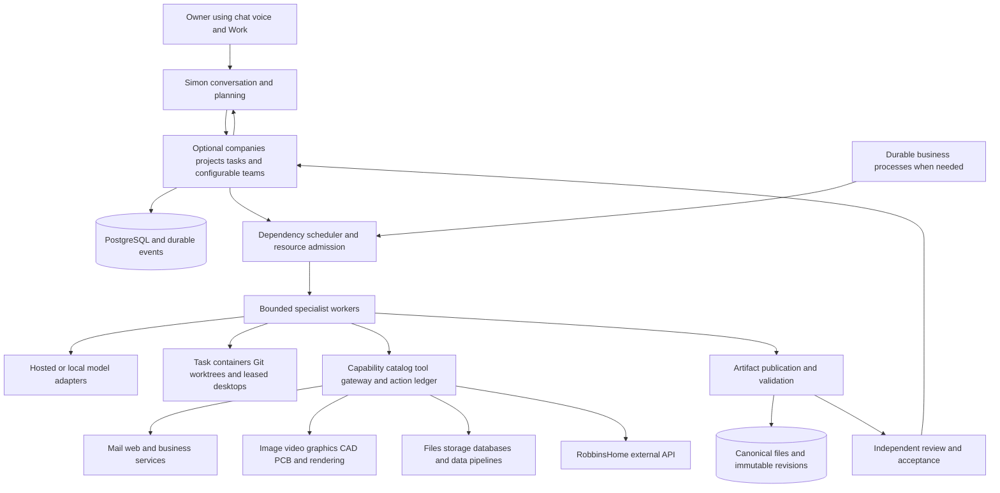

# Simon configurable multi agent platform plan

> Target design and original implementation backlog. The [current roadmap](../next-phases.md)
> owns delivery priority and reconciles the implemented features with remaining work.

The [October 7 autonomous work platform proposal](autonomous-work-platform-plan.md)
extends this design for AI-led staffing, shared agent/human boards, configurable model
providers and company operations. Use its decision register for the new direction and
the roadmap for current status; unconfirmed hosting and board changes remain proposals.

Prepared September 30, 2026. Status: target architecture and original design backlog.
The [Work platform](../runbooks/work-platform.md) now documents implemented project teams,
concurrent execution, tool adapters, native file publication, and verified dependency-file
transfer for Docker workers. Owner-reported checks and versioned acceptance are implemented.
Automated file-review evidence, repair, broader recovery, and shared spending controls remain
roadmap work.
The implementation snapshot and delivery sequence below preserve the planning context;
use the linked runbooks and current roadmap to determine what remains unimplemented.

Build Simon into the owner-facing coordinator for configurable workers, teams and tools. Support individual tasks, personal or shared projects, research programs, creative and engineering work, and persistent companies such as the clothing brand. Keep goals, permissions, deliverables, decisions, and operating visibility in Simon. Execute assignments through interchangeable worker runtimes, with durable scheduling and isolated working environments.

RobbinsHome is an independent home system exposed as an external tool, alongside storage, web, media, design and business services. The business system and research workers belong to Simon's general work platform. They have no dependency on home workflows, devices or storage. Home control does not define Simon's organization model, worker types or execution environment.

This plan adapts `AI_Agent_Company_Platform_Research.docx` to the existing Jarvis/Simon repository and the owner's clarification that all organization and tool choices should remain flexible. The document is research input, not an instruction to install its preferred stack. Its baseline of ten persistent roles, four to eight simultaneous workers, and two to four browser/desktop seats is one sizing example, not a fixed organization or product limit. None of those counts establishes throughput or output quality without measurement.

The recommended starting path is **Simon-owned coordination, PostgreSQL-backed task execution, hosted models, and one pluggable specialist runtime**. Evaluate the current runtime, a richer coding/agent runtime, and LangGraph against the same workloads. Paperclip with Hermes is the main alternative when obtaining a ready-made company-management backend matters more than keeping that backend inside Simon. Add Temporal when the first multi-day business process enters scope. Avoid installing multiple overlapping schedulers at the outset.

The platform core must remain usable without a company, a home connection, or any particular specialist application. Company management is an optional organizational layer. Adding an image generator, renderer, CAD application or data connector should normally require an adapter, capability definition and execution environment, rather than a redesign of Simon's scheduler.

## Product experience

The owner continues talking to Simon through chat and voice. A request such as “prepare a product launch” becomes a persistent goal with deliverables, budget, constraints, and a dependency graph. Simon explains the plan, delegates independent work, answers status questions while it runs, incorporates corrections, and presents the finished package with evidence.

Simon should expose a goal view showing assignments, dependencies, current owners, blocked reasons, spend, and deliverables. Each result opens the actual file or application state. Approval cards show the exact proposed email, deployment, order, attachment revision, or other commitment. A scoped artifact library makes outputs findable independently of the conversation that produced them; it can serve one task, a project, or a company.

Persistent agents are versioned role definitions and scoped knowledge, not permanently running model calls. A researcher may have no active process while waiting for a supplier. The scheduler wakes an execution attempt when there is useful work. Simon also releases execution capacity when waiting for specialists; status queries read recorded state rather than waking every agent.

Use one consistent Simon voice for owner communication. Specialists return structured findings and artifacts to Simon. Direct interaction with a specialist can be an optional inspection feature. It should preserve the same permissions, task ownership, and history.

## Work organization and reusable configuration

Separate the place work belongs, the team configuration, the execution attempt, and the tools it uses. These should be independently configurable rather than baked into a fixed company hierarchy.

| Concept           | Responsibility                                                                   | Examples                                                                         |
| ----------------- | -------------------------------------------------------------------------------- | -------------------------------------------------------------------------------- |
| Workspace         | Human membership, access boundary, defaults and shared resources                 | Personal workspace or shared business workspace                                  |
| Company           | Optional persistent organization, records, policies, teams and portfolio         | Clothing brand; another independent business                                     |
| Project           | Related goals, files, knowledge and work over time                               | Clothing launch, research study, PCB design, house research project              |
| Goal or task      | Requested result, dependencies, inputs, output contract and budget               | Compare materials, create an illustration, design an enclosure, prepare a report |
| Worker profile    | Versioned instructions, model routing, capabilities and environment requirements | Researcher, writer, general maker, CAD specialist, reviewer                      |
| Team template     | Reusable roles, delegation graph, review rules and resource policy               | Research pair, parallel software team, media studio, product development team    |
| Team assignment   | A template instantiated for a particular scope                                   | Temporary team for one task, project team, persistent brand team                 |
| Execution attempt | One bounded run with a leased workspace and current task authority               | Produce a draft, run CAD validation, inspect a rendered result                   |

A standalone task needs a workspace and owner, but no project or company. A project can be personal or belong to a company. A company can contain projects and recurring tasks without assigning every worker permanently to a department. The same worker profile or team template can be reused across all three levels; its live context, credentials and memory remain scoped to each assignment.

Simon can select an existing template, assemble an ad hoc team, or accept a team you configure directly. Support sequential pipelines, parallel branches, coordinator/specialist teams, author/reviewer pairs, recurring work and bounded exploratory groups. Team membership can change as a project evolves. A role's name is a useful specialization, not a permanent restriction on which tools it can use.

Provide a team editor in Simon and a versioned import/export format. Configuration should cover roles and instructions, model preferences, tool bundles, knowledge sources, storage destinations, environments, task dependencies, review requirements, concurrency, timeouts, budgets, schedules, notifications and standing action policies. Support cloning templates and overriding settings for one assignment. Show the resolved configuration and resource requirements before a plan begins executing.

Use field-specific configuration precedence. Platform and team/role templates provide baseline defaults; explicit choices resolve from workspace to optional company to optional project to task, with the most specific explicit choice winning. A template fills unspecified fields and cannot silently replace an explicit project setting. Treat access grants, spending/concurrency ceilings and any explicitly mandatory review/action requirements separately from ordinary defaults: a lower-level configuration may narrow them but cannot silently enlarge its parent's authority or allowance or remove a required review. A permitted task can explicitly select a different model, broader tool bundle, higher concurrency within every applicable cap, or a different optional review policy. Keep the audit record of the final resolved values and their sources.

Each task has one owning context and one accounting ancestry. Cross-project links are dependencies or explicit sharing grants, not a second parent budget or implicit permission to read another library. Cross-company collaboration uses separately scoped assignments and explicit artifact sharing. Reusing a team template does not reuse its previous company's facts or credentials.

Pin configuration, instructions, model policy and input revisions to an execution attempt. Future work can adopt a new template version; running work changes through a recorded steering or replan event. Permission revocations and emergency resource limits apply immediately. The four/eight-worker figures elsewhere in this document are deployment defaults to measure, not hardcoded limits or a required team shape.

For example, the same product-development template could serve a one-off enclosure design, a personal electronics project, or the clothing company's wearable-product project. It might combine research, CAD, electronics and visual-design profiles while selecting different data, applications, budgets and publication policies for each assignment. Research and writing teams do not require any company setup.

## What Simon already provides

These are observations from the current source, including the home extraction changes already in the working tree.

| Existing component                                                                                                    | Reuse                                                                          | Gap to close                                                                                                                                        |
| --------------------------------------------------------------------------------------------------------------------- | ------------------------------------------------------------------------------ | --------------------------------------------------------------------------------------------------------------------------------------------------- |
| Chat, voice, streaming, accounts and projects                                                                         | Keep Simon as the front door                                                   | Add goal, team, dependency, review and capacity views                                                                                               |
| [Assistant tasks](../../src/simon/services/tasks.py) and [work sessions](../../src/simon/services/work_sessions.py)   | Persisted jobs, priority, pause/cancel/steer, optimistic versions and recovery | No specialist identity, parent goal, dependency graph, delegated grant or independent task budget                                                   |
| [Assistant worker](../../src/simon/assistant_worker.py)                                                               | Separate background process                                                    | Hardcoded two session threads and one task thread; these are per-process limits, not system-wide concurrency controls                               |
| [Job contracts](../../src/simon/domain/models.py) and [PostgreSQL adapter](../../src/simon/adapters/postgres.py)      | Transactions, version checks, audit and outbox                                 | SQL has lease columns, but the runtime does not implement explicit worker leases, heartbeats or stale-owner fencing                                 |
| [OpenAI model adapter](../../src/simon/adapters/openai_model.py)                                                      | Bounded model/tool execution                                                   | Tools run serially with `parallel_tool_calls=False`; bounded rounds and roughly 90–120 second tool-enabled runs do not provide hours-long execution |
| [Task artifacts](../../src/simon/domain/tasks.py)                                                                     | IDs, checksums, project/task association                                       | Task-generated artifacts are small text outputs, capped at 512 KiB per file; no general media catalog or immutable revision graph                   |
| [Project files](../../src/simon/services/project_files.py) and [local files](../../src/simon/services/local_files.py) | Drive integration, mutation receipts, file checks and backups                  | Add isolated task workspaces and publication into a shared library                                                                                  |
| [Connected tools](../../src/simon/services/connected.py) and [policy](../../src/simon/services/policy.py)             | Existing scope checks and action records                                       | Workers inherit human role authority; tool enforcement is split across paths; generic hard-write confirmation verification remains unfinished       |
| [External home client](../../src/simon/adapters/home_client.py)                                                       | Existing external-service boundary                                             | Keep home grants optional and separate from business-worker defaults                                                                                |

There is no existing general coding shell, browser automation pool, desktop seat manager, or dynamic MCP worker platform in this source. Those are implementation work. Current model-visible task creation is a useful delegation entry point, but it creates generic tasks under the user rather than independently scoped specialists.

Before increasing concurrency, fix two concrete serialization points. `ModelConversationService.submit` can fetch remote home history while holding a household transaction. Local file mutations and ZIP work also hold a household transaction. Move slow I/O out of broad transactions while retaining short, version-checked commits and resource-specific exclusion. The standalone worker also needs deliberate database pool sizing rather than relying on per-operation connections.

## Architecture and ownership

Start with modules and separate worker processes in the existing repository. This is a separation of responsibility; it does not require ten new microservices. Keep the control service and database available when a worker container fails. Move execution to additional hosts when resource measurements justify it.

| Information or operation                                                   | Authoritative owner in the recommended design                                    |
| -------------------------------------------------------------------------- | -------------------------------------------------------------------------------- |
| Human conversation, goals, task specifications, grants and approval policy | Simon                                                                            |
| Optional companies, projects, worker profiles and team templates           | Simon work platform; independent of RobbinsHome                                  |
| Assignment state and readiness for simple tasks                            | Simon scheduler and PostgreSQL                                                   |
| A multi-day process after adopting Temporal                                | Temporal workflow history; Simon exposes a projection and sends commands/signals |
| Model/tool loop state within a bounded assignment                          | Selected worker runtime, indexed by Simon attempt ID                             |
| External action intent, authorization and receipts                         | Tool gateway/action ledger                                                       |
| File identity, immutable revision and approved pointer                     | Artifact service                                                                 |
| Canonical bytes                                                            | Configured object/file service                                                   |
| Physical device state and home command receipts                            | RobbinsHome                                                                      |

A runtime may store private checkpoints, but it cannot independently change company approvals or publish an accepted result. Simon must be able to reconstruct what matters from task records, artifacts and receipts if that runtime is replaced.

## Orchestration patterns

| Pattern                                          | Where it helps                                                    | Decision for Simon                                                               |
| ------------------------------------------------ | ----------------------------------------------------------------- | -------------------------------------------------------------------------------- |
| One agent with tools                             | Small requests with little independent work                       | Keep as the default for ordinary conversation and simple actions                 |
| Manager calling specialists                      | Research, code, design and synthesis with one owner-facing answer | Primary interaction pattern; Simon retains ownership                             |
| Dependency graph with parallel branches          | Several deliverables with shared inputs and explicit joins        | Primary execution pattern; scheduler enforces the graph                          |
| Hierarchical teams                               | Large projects with distinct departments                          | Add after flat teams work; initially limit delegation depth to two               |
| Specialist handoff                               | A specialist should temporarily own a user interaction            | Optional, explicit UI behavior, not the default company workflow                 |
| Shared task board                                | Asynchronous workers discover or receive assignments              | Use durable records with atomic claims; avoid unowned shared documents           |
| Peer debate or autonomous swarm                  | Narrow critique or multiple hypotheses                            | Bounded experiment only; fixed participants, rounds and cost                     |
| Deterministic business workflow with agent steps | Quotations, approvals, samples, invoices and release processes    | Required for dependable long waits and external commitments                      |
| Independent redundant attempts                   | Difficult decisions where comparison improves quality             | Selectively use two approaches and a reviewer; charge all attempts to one budget |

OpenAI documents the distinction between manager-owned specialist calls and handoffs that transfer conversational ownership. The former matches the requested Simon experience. A synchronous specialist tool call is still only a local orchestration primitive: long tasks must return an assignment ID and continue through durable execution. [OpenAI orchestration and handoffs](https://developers.openai.com/api/docs/guides/agents/orchestration)

The planning model proposes the graph. Ordinary application code validates permissions, dependencies, cycles, concurrency, resource requirements and budget before admitting it. A model cannot grant itself another credential or bypass a failed acceptance check by rephrasing its plan.

## Platform options

The following fit assessments are architectural judgments, not benchmark results. These products occupy different layers; using a worker SDK does not eliminate the need for a task system and shared-output model.

| Option                                                                                           | How Simon stays primary                                                                 | Advantages                                                                 | Costs and limits                                                                  | Selection guidance                                                          |
| ------------------------------------------------------------------------------------------------ | --------------------------------------------------------------------------------------- | -------------------------------------------------------------------------- | --------------------------------------------------------------------------------- | --------------------------------------------------------------------------- |
| Extend the current Simon loop                                                                    | Simon owns all product and coordination state                                           | Least migration; existing tools and controls remain useful                 | Must build robust execution contracts, scheduling, recovery and context isolation | Default control layer; retain for simple bounded work                       |
| OpenAI Agents SDK                                                                                | Run SDK specialists behind a worker adapter                                             | Typed tools, manager/specialist composition, sessions and integrations     | Application still owns deployment, storage and business policy                    | Candidate default for general specialists                                   |
| Codex SDK                                                                                        | Delegate repository tasks to a coding worker and surface progress/results in Simon      | Existing coding harness rather than a new shell agent implementation       | Requires sandbox, workspace, auth, version and lifecycle integration              | First coding-specialist candidate                                           |
| OpenAI Agents API                                                                                | Simon submits assignments and receives events/results from a managed harness            | Managed session/harness; hosted, self-hosted or no execution environment   | Provider dependency; verify access, retention, event recovery and economics       | Managed-runtime candidate when reducing harness operations matters          |
| LangGraph with optional [Deep Agents](https://docs.langchain.com/oss/python/deepagents/overview) | Simon owns business records; graph workers own bounded execution checkpoints            | Explicit branching, checkpoints, interrupts; richer harness available      | Hosting, grants, action reconciliation and artifact publication remain ours       | Strong candidate for custom graph-heavy specialists                         |
| Paperclip with Hermes                                                                            | Simon becomes the conversation/interface layer over Paperclip's canonical company tasks | Existing goals, issues, budgets, approvals, artifacts and runtime adapters | Second stack, identity mapping, event reconciliation and product overlap          | Best alternative when speed to a company dashboard wins                     |
| Agno AgentOS                                                                                     | Separate agent/team execution API behind Simon                                          | Python/FastAPI alignment, persistence and runtime operations               | Overlaps Simon's API, identity, sessions and schedules                            | Evaluate if SDK integration leaves too much service infrastructure to build |
| [Claude Agent SDK](https://code.claude.com/docs/en/agent-sdk/overview)                           | Another isolated specialist adapter                                                     | Alternative coding/tool harness and model ecosystem                        | Separate terms, credentials, runtime and recovery validation                      | Evaluate on the same tasks when model diversity has value                   |
| [Claude Managed Agents](https://platform.claude.com/docs/en/managed-agents/overview)             | Managed asynchronous harness behind the worker interface                                | Alternative to operating the agent harness ourselves                       | Currently beta; validate access, retention, recovery, sandbox and usage controls  | Compare with other managed runtimes if operational simplicity is a priority |

The OpenAI options above are distinct: the Agents SDK runs in the application, the Agents API supplies a managed harness, and Responses exposes lower-level model interaction. Simon can preserve its business contracts across them. The current Codex SDK documentation provides Python and TypeScript integration; for a Python repository, a Node service is not inherently required. Prefer SDK integration for jobs; the App Server documentation currently labels its WebSocket transport experimental and unsupported, so do not make an exposed WebSocket server the production foundation. [OpenAI runtime comparison](https://developers.openai.com/api/docs/guides/agents), [Agents API architecture](https://developers.openai.com/api/docs/guides/agents-api/architecture), [Codex SDK](https://developers.openai.com/codex/sdk), [Codex App Server](https://developers.openai.com/codex/app-server)

Paperclip already supports local and gateway Hermes adapters. A Simon connector would still be new work. In this alternative, Paperclip must own task statuses, dependencies, dispatch and company budgets. Simon stores external IDs and read projections, rather than maintaining a second writable copy of those records. Reuse Paperclip's artifacts and approval features where they fit, and add only missing business semantics. [Paperclip](https://github.com/paperclipai/paperclip), [Hermes adapters](https://github.com/paperclipai/paperclip/blob/master/packages/adapters/hermes/README.md), [Paperclip artifacts](https://docs.paperclip.ing/guides/day-to-day/artifacts/)

Paperclip's isolated workspace interface remains experimental in current documentation; validate the pinned release before depending on it. [Paperclip execution workspaces](https://docs.paperclip.ing/guides/projects-workflow/workspaces/)

The recovery distinctions matter. LangGraph can retain successful branch writes after another parallel branch fails, but cannot prove an external action happened exactly once. Agno's durable queue fails a crashed run visibly by default; enabling additional attempts re-executes the run from the beginning. Hermes distinguishes durable delivery of completed results from interrupted child execution, which can become unknown; separate terminal sessions do not establish sandbox isolation. Test these boundaries in the pinned release. [LangGraph checkpointers](https://docs.langchain.com/oss/python/langgraph/checkpointers), [Agno durable queue](https://docs.agno.com/agent-os/background-execution/durable-queue), [Hermes delegation](https://hermes-agent.nousresearch.com/docs/user-guide/features/delegation)

Other credible options deserve a defined place rather than a default installation:

| Option                                                                                                                                                                                                           | Appropriate use                                                         | Why it is not the initial foundation                                                               |
| ---------------------------------------------------------------------------------------------------------------------------------------------------------------------------------------------------------------- | ----------------------------------------------------------------------- | -------------------------------------------------------------------------------------------------- |
| [CrewAI](https://docs.crewai.com/en/concepts/flows)                                                                                                                                                              | A bounded research, marketing or reporting crew                         | Role composition does not settle company storage, approvals or effect reconciliation               |
| [Microsoft Agent Framework](https://learn.microsoft.com/en-us/agent-framework/overview/)                                                                                                                         | Typed workflows and Microsoft-oriented integrations                     | Adopt if that ecosystem materially reduces integration work                                        |
| [Google ADK](https://adk.dev/agents/workflow-agents/parallel-agents/)                                                                                                                                            | Google-oriented specialists and parallel branch execution               | Requires explicit state coordination and the same company controls                                 |
| [OpenClaw](https://docs.openclaw.ai/concepts/multi-agent)                                                                                                                                                        | Messaging channels and persistent agent identities                      | Overlaps Simon's interface; use behind it only for a demonstrated capability                       |
| [Agent Zero](https://github.com/agent0ai/agent-zero)                                                                                                                                                             | Evaluate a Linux desktop/browser/office worker                          | Desktop tooling still needs leases, output verification and business controls                      |
| [Letta Code](https://github.com/letta-ai/letta-code)                                                                                                                                                             | A specialist with persistent working memory                             | Keep approved company facts outside a harness-specific memory system                               |
| [n8n](https://github.com/n8n-io/n8n-docs/blob/main/docs/deploy/host-n8n/configure-n8n/scaling/enable-queue-mode.md)                                                                                              | SaaS glue, webhook processing and deterministic integration jobs        | Its queue/workflows must have a distinct owner; some operating features have separate entitlements |
| [Dify](https://github.com/langgenius/dify) or [AutoGPT Platform](https://github.com/Significant-Gravitas/AutoGPT)                                                                                                | Business users who need an external visual builder                      | Additional application and licensing model; less direct fit for extending Simon                    |
| [AWS AgentCore](https://docs.aws.amazon.com/bedrock-agentcore/latest/devguide/runtime-long-run.html) or [Google managed agent platform](https://docs.cloud.google.com/gemini-enterprise-agent-platform/overview) | Managed execution, future cloud scale or recovery                       | Evaluate hosting and account requirements; company semantics remain an application concern         |
| Kubernetes                                                                                                                                                                                                       | Multiple execution hosts, resource scheduling and deployment operations | Four to eight workers alone do not justify a cluster; it is not an agent framework                 |

The research also lists Flowise. Its repository is archived; exclude it from a new core shortlist unless a maintained successor is evaluated. Check exact licenses, versions and commercial entitlements before choosing any runtime or hosted service. This plan makes no claim that a framework installation includes desktop software, paid connectors or model access. [Flowise repository](https://github.com/FlowiseAI/Flowise)

Run a short comparison using the same research-to-report and repository-change tasks through the current Simon loop, one richer worker adapter, and LangGraph/Deep Agents. Assess Paperclip/Hermes separately as an alternative management backend. Prefer the smallest stack that meets the recovery and output tests. Framework choice should not change company artifact IDs or external action contracts.

## Concurrency and scheduling

Define five separate quantities: persistent roles, ready assignments, leased executions, in-flight model calls, and scarce resources such as desktop seats. Ten roles can have hundreds of waiting tasks while only four executions run. Model inference, browser use and CPU-heavy builds need different limits.

| Control                                     | Pilot proposal                            | Target proposal                                          |
| ------------------------------------------- | ----------------------------------------- | -------------------------------------------------------- |
| Persistent role definitions                 | Simon plus researcher, maker and reviewer | Simon plus nine specialists                              |
| Total execution slots                       | 4                                         | 8 after load and recovery tests                          |
| Interactive reservation                     | 1 within the total                        | 1 within the total; reserve model quota too              |
| Background maximum                          | 3                                         | 7; reviewer gets scheduling priority                     |
| Simultaneously controlled GUI/browser seats | 1 initially, then 2                       | 2 initially at target load; increase to 4 when justified |
| Delegation depth                            | 1                                         | At most 2 by default                                     |
| Children per decomposition                  | 3                                         | At most 6 by default                                     |
| Review/rework cycles                        | 1                                         | At most 2 before owner escalation                        |

These are proposed starting policies, not measured capacity. A browser/desktop seat is held by one of the active workers and is not added to the worker count. Headless browser contexts may be cheaper than full desktops, but still have independently controlled account sessions. Assign expensive CPU, GPU and media work to their own resource pools.

Implement atomic `claim_ready_task` using short PostgreSQL transactions and row locking, for example `FOR UPDATE SKIP LOCKED`. A claim creates an attempt ID, lease owner, lease expiry and increasing fencing token. Completion, artifact publication and external dispatch verify the current token. Expired workers can no longer mutate shared outputs. Heartbeats use database time and explicit lease fields, rather than an unrelated `updated_at` timestamp.

Apply quotas across all API and worker processes, not inside a local Python semaphore alone. Add priority aging and per-workspace fairness. Acquire resource reservations in a consistent order; do not occupy an execution slot indefinitely while waiting for a desktop or another agent. A parent awaiting child results becomes `waiting_dependencies` and releases its slot. Otherwise a pool can deadlock when every slot is held by a parent waiting for queued children.

Useful task states are proposed, ready, running, waiting_dependencies, waiting_external, waiting_approval, needs_reconciliation, reviewing, succeeded, failed and cancelled. Attempts have their own state and lifetime. Cancellation stops new work, revokes active grants and requests runtime shutdown; it cannot undo an action already accepted by an external provider.

Preserve one writer per conversation. Every specialist receives its own execution context; results are joined through records, not concurrent writes into Simon's chat. Parallelize independent research, generation and validation. Serialize writes to the same business object, repository integration branch, binary design file, browser account or desktop seat.

## Agent identity and task contracts

An example company configuration could include Simon, operations coordinator, researcher, product/manufacturing specialist, supplier specialist, designer, engineer, marketing specialist, finance analyst, and reviewer. A research project might use only two researchers and a reviewer; a CAD task might use a maker and checker. These are editable templates, not built-in worker types or a required organizational chart. Roles can share a model endpoint and access overlapping tool bundles. Begin with a small template and add profiles as needed.

Do not create ten owner accounts. Every call should carry the human/workspace principal, acting agent, goal, task, attempt and delegated grant. Effective authority is the intersection of the human's current access, role policy, task grant, resource restrictions and current approval. Revalidate immediately before consequential dispatch and publication.

Each assignment needs objective, role/version, input artifact revisions, structured records, required output types, acceptance criteria, allowed tools and accounts, forbidden operations, deadline, maximum spend, model/step limits, resource class, cancellation policy and escalation conditions. Include only relevant context and source provenance. A research page or imported file cannot supply new operating instructions or authority.

The worker contract should support `start`, `events`, `checkpoint`, `cancel`, `resume_or_reconcile`, and `collect_result`. Return normalized statuses, usage, artifact IDs, evidence references, action receipts, defects and blocking questions. Runtime session IDs are adapter details. Some runtimes can truly resume; others must begin another attempt from a checkpoint packet. Make that difference explicit.

Runtime adapters must constrain built-in shell/network tools and internal subagents as well as Simon-provided tools. Hidden child execution cannot bypass global resource limits, delegated authority or parent budgets. If a runtime cannot expose or enforce the required accounting, disable its internal delegation and let Simon dispatch children explicitly. Managed runtime selection must test this requirement too.

Persist role instruction versions and evaluation results. Keep personal conversation memory, task scratch context, role procedures and approved company facts separate. Suppliers, quotations, products, orders and approved prices should become structured records with sources and effective dates. Search and embeddings index those records; they do not replace them.

## Shared output and quality

A finished assignment must produce a verifiable deliverable. A model response saying “done” is insufficient. Define output contracts for reports, spreadsheets, code, graphics, web changes and operational actions. Include editable sources as well as exports where the workflow needs later editing.

Extend the artifact model with stable artifact identity, immutable revision ID, checksum, media type, byte location, source revisions, generating task/attempt, model/prompt/runtime version, validation evidence, review status and approved revision pointer. Preserve old task artifacts and add a migration bridge; do not rewrite historical IDs to adopt the new store.

Publication should stage bytes, verify their checksum and format, then commit an immutable candidate revision and an outbox event. Promotion to the approved pointer is a separate metadata transaction requiring accepted review, current authority and ownership, and the expected current approved revision. Handle the gap between file/object writes and database commits explicitly: incomplete uploads and orphaned blobs become reconciliation work. Do not promise a cross-service transaction that the storage backend does not provide.

Each worker edits a working copy based on a named revision. Publishing includes that expected revision. Concurrent changes create a conflict or separate candidate revisions; they never silently overwrite an approved file. Binary sources need exclusive edit leases or separate candidates. Code uses isolated Git worktrees and branches, followed by a serialized integration queue that runs checks against the current target commit. A worktree separates files; a container/VM and scoped credentials provide the execution boundary.

| Storage option                    | Strength                                                 | Tradeoff                                                                   | Proposed use                                                       |
| --------------------------------- | -------------------------------------------------------- | -------------------------------------------------------------------------- | ------------------------------------------------------------------ |
| Existing Google Drive integration | Smallest change; useful browser sharing                  | External account/API dependency; revision/promotion semantics still needed | Lowest-effort pilot when existing Drive use is acceptable          |
| Nextcloud through WebDAV/API      | Locally controlled company library and human clients     | Additional service, database, backups and synchronization                  | Preferred local-drive option when local file ownership is required |
| Object storage plus Simon library | Clear immutable blob and metadata design; media-friendly | Must build human search, previews and editing workflows                    | Artifact backend as output volume grows                            |
| NAS/SMB filesystem                | Familiar shared files and bulk capacity                  | Direct edits can bypass metadata and revision checks                       | Bulk storage behind supported publication interfaces               |
| Git                               | Code and text history, branches and review               | Poor fit for arbitrary binary collaboration                                | Code sources and text configuration                                |

Choose one canonical location per artifact; other destinations are exports or synchronized projections. Use supported Nextcloud interfaces rather than modifying its private data directory. Its transactional file locking does not prevent multiple people from editing their own copies, so application-level revision checks are still necessary. [Nextcloud WebDAV](https://docs.nextcloud.com/server/stable/user_manual/en/files/access_webdav.html), [Nextcloud file locking](https://docs.nextcloud.com/server/stable/admin_manual/configuration_files/files_locking_transactional.html)

Detect human edits through Drive or Nextcloud and import them as new draft revisions. Approved revisions retain immutable byte snapshots; an edit must not silently replace or promote an approved release. Downstream assignments remain pinned to their recorded inputs until explicitly replanned.

The quality loop is generate, validate, independently review, repair within a limit, and accept/publish. Use deterministic validators first: open the file, parse the spreadsheet, recalculate totals, run tests, verify links, inspect rendering, compare deployment state and check required sections. Model review handles judgment that cannot be reduced to those checks. A different reviewer prompt is helpful but does not guarantee independent errors; use different evidence or a second model selectively.

Track accepted deliverables per hour, first-pass acceptance, defects found after acceptance, owner correction time, cost per accepted deliverable and artifact retrieval success. Large files, token volume and the number of agent messages are not productivity measures.

## Capability catalog and execution environments

Make broad tool access a first-class platform feature. Provide an extensible capability catalog spanning creative work, engineering, research, software, business operations, storage, data and connected systems. The catalog is open-ended; the initial adapters are a starting set, not the boundary of what Simon can do.

Distinguish a capability from its provider and execution method. For example, `image.generate`, `video.compose`, `cad.model`, `pcb.validate`, `render.submit`, `document.write`, `data.query` and `storage.publish` are proposed capability names. Each can have one or more implementations with different quality, cost, location and environment requirements. A task selects an output contract and capability requirements; the scheduler selects an eligible implementation or uses the configured preference.

| Tool family               | Capabilities to support                                                                             | Execution options                                                                    | Deliverables and checks                                                                                                 |
| ------------------------- | --------------------------------------------------------------------------------------------------- | ------------------------------------------------------------------------------------ | ----------------------------------------------------------------------------------------------------------------------- |
| Research and web          | Search, browsing, extraction, downloads, citation capture and monitoring                            | Search/API connectors, HTTP tools, browser automation, desktop browser               | Evidence manifest, source snapshots, retrieval dates and checked references                                             |
| Writing and documents     | Reports, long-form writing, presentations, spreadsheets, document conversion and templates          | Model tools, document libraries, office APIs, desktop office applications            | Editable sources plus DOCX/PDF/slides/sheets; openability, layout and calculation checks                                |
| Images and graphic design | Image generation/editing, vector design, typography, compositing, branding and print preparation    | Generation APIs/local models, graphics scripts, application plugins, desktop tools   | Source layers/SVG/native files plus exports, dimensions, color profile, font and asset dependencies                     |
| Video and audio           | Generation, storyboards, editing, compositing, captions, voice/audio work and encoding              | Hosted or local generation, media CLI jobs, editing application APIs/desktops        | Source clips, timeline or reproducible assembly recipe, audio/subtitles and final exports                               |
| 3D design and rendering   | Scene construction, modeling, materials, lighting, animation, simulation and batch rendering        | Native scripting, headless application workers, GPU/render services, desktop control | Native scene, textures/dependencies, preview, interchange files, render settings and final media                        |
| CAD and mechanical design | Parametric geometry, assemblies, drawings, dimensions and manufacturing exports                     | CAD APIs/macros, supported headless jobs, licensed desktop sessions                  | Native parametric model, constraints, units/tolerances, drawings and STEP/STL or other specified exports                |
| PCB and electronics       | Component research, schematic/board editing, libraries, rule checking, BOM and manufacturing output | EDA CLI, application API/IPC, scripts, dedicated desktop sessions                    | Native project, libraries, ERC/DRC reports, BOM, Gerbers/drills and previews; additional functional checks as specified |
| Software and computation  | Code, builds, tests, notebooks, numerical work and simulations                                      | Isolated containers, worktrees, job runners, remote compute                          | Source, environment/dependency manifest, reproducible commands, tests and result artifacts                              |
| Files and storage         | Create, organize, revise, convert, search, transfer, synchronize and archive                        | Local workspaces, drives, NAS, object storage and storage APIs                       | Stable artifact IDs, checksums, revision history, previews and retrievable native bytes                                 |
| Data management           | Database queries, imports, transformations, cataloging, analytics, structured records and pipelines | Scoped SQL/data APIs, notebooks, ETL jobs and storage connectors                     | Schema/data versions, lineage, transformation recipe, validation results and controlled updates                         |
| Business services         | Mail, calendar, supplier records, website/CMS, inventory, commerce and accounting integrations      | Typed APIs, MCP adapters, integration jobs and browser workflows                     | Structured records, documents, previews and external action receipts                                                    |
| Connected systems         | Home status and controls, and other independently operated services                                 | External service adapters such as RobbinsHome                                        | Service-owned state and receipts linked to the Simon task                                                               |

These are integration targets, not a claim that the current repository already supports them. A catalog entry must distinguish known, installed, configured, authorized, healthy and temporarily busy. Show missing credentials, applications, licenses, storage or hardware explicitly. A task can wait for provisioning or choose an allowed alternative; it must not report unsupported work as completed.

Let workers discover relevant tools on demand instead of placing every tool schema in every prompt. Tool bundles are configurable conveniences, such as research, media studio or electronics. They do not permanently silo roles: a researcher can use a spreadsheet and plotting tool, and a product worker can combine graphics, CAD and component data. Permit broad capability profiles where configured, while resolving which accounts, files and environments the particular assignment may use.

Every adapter should publish a versioned manifest with operation schemas, supported input/output formats, execution methods, application/provider version, authentication bindings, resource requirements, cost accounting, timeout, retry/cancellation/reconciliation behavior, progress reporting and validation hooks. Adding a tool through HTTP, MCP, a CLI wrapper, native scripting, IPC or computer control should preserve this common contract. Do not automatically execute newly discovered or installed tools without the configuration that makes them available to the assignment.

Execution backends should cover ordinary API calls, isolated Python/Node/CLI processes, containers, browser contexts, Windows/macOS/Linux application sessions, GPU jobs and remote/managed services. Match tasks to capabilities and available applications rather than assuming every worker runs on the same operating system. Each backend owns scratch cleanup, saved output collection and the lifecycle of its environment.

Long generation, rendering, simulation and encoding operations need durable tool-job records: submit, observe progress, cancel if supported, reconcile and collect. Store the provider/job ID before waiting and use idempotent submission where available. Release the agent's reasoning slot while the job runs; retain the GPU/render/license reservation until that job ends. Track timeout or lost contact as an uncertain job state instead of blindly paying for a second submission. Callbacks or scheduled status checks can wake the task without repeated model polling.

Keep authoring, rendering and validation separable. A designer can finish and publish a scene, a render backend can produce several views concurrently, and a reviewer can inspect the collected output. Reserve GPU memory, CPU, desktop seats, application licenses, disk/network bandwidth and provider quotas independently. Configurable per-workspace/project/company fairness prevents a large render queue from blocking interactive Simon or unrelated research.

Concrete adapter candidates demonstrate why computer control should be one method among several. Blender documents background execution, Python scripts and rendering; KiCad's CLI documents electrical/design-rule checks and manufacturing exports; FFmpeg supports batch media processing; Inkscape exposes command-line actions and exports. Use desktop control for operations that require it, while exposing scriptable operations through structured tools. Pin and probe installed versions before advertising their capabilities. [Blender command line](https://docs.blender.org/manual/id/4.0/advanced/command_line/arguments.html), [KiCad CLI](https://docs.kicad.org/10.0/en/cli/cli.html), [FFmpeg documentation](https://ffmpeg.org/ffmpeg.html), [Inkscape command line](https://wiki.inkscape.org/wiki/Using_the_Command_Line)

Some operations have different requirements even inside one application. KiCad's documented IPC behavior depends on version; the documented KiCad 9/10 path requires a running GUI, whereas CLI validation/export is a separate surface. FreeCAD is another CAD adapter candidate, with console/Python workflows to evaluate separately from GUI workbenches and view-dependent operations. A successful rules check, render or export proves only that check's contract, not the entire design's fitness for its intended use. [KiCad IPC documentation](https://dev-docs.kicad.org/en/apis-and-binding/ipc-api/for-addon-developers/), [FreeCAD headless documentation mirror](https://github.com/FreeCAD/FreeCAD-documentation/blob/main/wiki/Headless_FreeCAD.md)

Native artifacts often contain multiple linked files. Publish a bundle manifest for scene textures, fonts, CAD references, PCB libraries, scripts, media clips and other dependencies. Record application/plugin versions, render settings, units and relevant generation parameters. Preserve source and derived outputs together, with content hashes and lineage, so another worker can reopen and revise the work without an undocumented path on the original desktop.

## Tools and external actions

Prefer a supported business API, then a stable application automation interface, then browser automation, then graphical desktop control where necessary. A desktop worker needs a compatible operating system, installed software, license, authenticated session, screenshot/input adapter and verified export path. None of these is supplied merely by naming a “designer agent.”

Each desktop gets a lease, one controlling task, a clean/reset procedure, bounded persistent account state, temporary download area and a way to stop input immediately. Pause visibly for login expiry, CAPTCHA or unsupported dialogs. Never let concurrent workers share mouse/keyboard control. Start with API and browser workflows before committing to difficult native design applications.

Enforce seat tokens in a host-side input proxy. Before reassigning an expired seat, stop or quarantine the previous controller and reset or verify the session. A database lease alone cannot prevent an old process from continuing to type or click.

Place credentials in a connector service where possible. Workers receive restricted task capabilities rather than reusable owner credentials. Generated code should not access the control database, unrestricted company drive, Docker daemon or host admin account. Enforce filesystem and network access in the execution environment; a tool's declared path policy does not constrain a separate shell automatically. [Deep Agents overview](https://docs.langchain.com/oss/python/deepagents/overview)

Use MCP when it simplifies standardized tool discovery and calls. Keep typed HTTP interfaces for first-party services such as RobbinsHome where they are already clear. Consider A2A for independently administered agent systems; internal Simon specialists can use the worker contract without it. Neither protocol supplies permission policy, durable task ownership or artifact acceptance. [MCP specification](https://modelcontextprotocol.io/specification/2026-07-28), [A2A specification](https://a2a-protocol.org/latest/specification/)

For every consequential external action, record a stable action ID, exact payload and artifact revisions, actor/agent/grant, approval evidence or standing policy, dispatch state, provider receipt and reconciliation result. Where a provider supports idempotency keys, reuse the same key for the same intent. Changed recipients, amounts, files or destinations require a new intent and whatever authorization its policy requires.

Gateway acceptance must atomically validate the current grant and fencing token and claim the action intent. Once accepted, the gateway owns dispatch and reconciliation even if the worker expires. A replacement worker consults the same intent. A non-atomic permission check followed by an independent worker-side send is insufficient.

If a worker loses contact after dispatch, mark the action unknown and reconcile with the provider before resubmission. Queue redelivery, workflow replay and container restarts do not guarantee exactly-once external effects. Internal drafts, research and permitted file organization can proceed autonomously. Configure standing policies for routine actions and request human decisions only for actions outside those policies. Avoid approval on every model call.

RobbinsHome keeps its own authorization and receipt checks. Business specialists receive no home capability by default. A home assignment uses the external API with narrow task authority, correlation IDs and stable action mapping. Never reintroduce home drivers or direct home database access into Simon to simplify orchestration.

## Long-running processes and recovery

The initial PostgreSQL scheduler is sufficient for a small durable task graph, explicit waits and worker claims, provided its recovery behavior is implemented and tested. Four to eight agents alone do not require Temporal.

Adopt Temporal for the first process with several durable timers, external messages, approvals and compensating steps, such as supplier quotation through sample approval. Workflow code owns transitions and waits; bounded agent work and external I/O execute outside deterministic workflow code. Waiting releases execution capacity. Version workflow definitions so existing processes can finish after releases. [Temporal workflow messages](https://docs.temporal.io/develop/python/workflows/message-passing)

If Temporal is selected, it owns that process's transitions. Simon's task views become projections of those states; the existing scheduler may still admit bounded execution resources but cannot independently advance the same workflow. LangGraph may run inside a bounded extraction/review activity if useful. Do not give both engines authority to retry the same business action.

Use a transactional outbox to connect committed state with future delivery, deduplicate incoming events, correlate supplier replies to existing requests, and retain unprocessable events for inspection. A restored backup may predate real-world actions; run action reconciliation before reopening dispatch. Recovery after a whole-host outage is distinct from remaining continuously available through the outage.

## Capacity and economics

Actual output depends on available independent work, the critical path, model latency, provider quotas, review capacity, GUI occupancy, rework and owner decisions. A plan with eight independent research branches can benefit from eight workers; a sequential negotiation cannot advance eight times faster.

For a workload with an independent fraction `p`, the idealized speedup ceiling with `N` workers is `1 / ((1-p) + p/N)`, before coordination overhead. With 80% parallel work and eight workers, that ceiling is about 3.3 times. This is an explanatory bound, not a Simon performance prediction.

For steady-state planning, accepted outputs per hour are approximately `productive worker-hours available per hour / total author, reviewer and repair worker-hours per accepted output`. With seven background slots at 60% productive utilization, there are 4.2 productive worker-hours per hour. If an accepted bounded output consumes 20 total worker-minutes including its share of failed work and review, the illustrative result is 12.6 outputs/hour. These are comparable small deliverables, not twelve completed product launches. The reserved interactive slot is excluded from this background calculation.

Desktop capacity can dominate: two seats at 70% utilization with 30-minute jobs permit about 2.8 desktop jobs/hour before additional failures. Faster model inference does not remove that bottleneck. Waiting for external responses consumes no worker slot, but still extends end-to-end delivery time.

An illustrative seven-background-worker model load at two calls per minute per worker, 8,000 input tokens and 1,000 output tokens per call is 14 calls/minute, 112,000 input tokens/minute and 14,000 output tokens/minute. Add measured interactive Simon demand and quota headroom; reviewer and retry activity already consume the same background pool. Use real provider accounting, shared-model limits and response headers. A local concurrency limit cannot create provider quota. [OpenAI rate limits](https://developers.openai.com/api/docs/guides/rate-limits)

Record cost per model/tool call using a dated price catalog. Budget per attempt, task, goal, workspace and time period. Atomically reserve expected maximum spend before concurrent dispatch, settle actual usage afterward, and retain a conservative reservation when usage is unknown. Otherwise several workers can independently spend the same apparent remaining balance. Children, reviews and retries consume the parent's aggregate budget.

Include media generation, rendering, desktop/application time and data processing in the same accounting. Each usage event is charged once to its originating attempt/task and can roll up through project, optional company and workspace reports without being charged repeatedly. Reserve against every applicable ceiling atomically; sharing a worker profile across teams does not create another spending allowance.

Monthly API estimates should derive from measured input, cached input, output, reasoning, image/audio and tool usage at the chosen provider's current rates. Add search/media services, desktop/SaaS seats, storage, backups, host costs and engineering time. This plan deliberately supplies no unverified provider price or hardware quote. Compare total cost per accepted business outcome and owner intervention, not token prices alone.

## Hosting and local inference options

| Deployment                                          | Best fit                                            | Main limitation                                                                                            |
| --------------------------------------------------- | --------------------------------------------------- | ---------------------------------------------------------------------------------------------------------- |
| Existing Windows development machine, hosted models | Fast initial implementation and tests               | Shared workstation availability and desktop interference; separate workers from the owner's active desktop |
| Dedicated Linux host, containers, hosted models     | Recommended initial operational deployment          | Internet/API dependency; still needs backups and an operator                                               |
| Local control/storage with cloud workers            | Bursty builds, coding and occasional large jobs     | Transfer, secrets and private-network design                                                               |
| Cloud control and execution                         | Remote availability and managed operations          | Recurring cost, data location and connectivity to local tools                                              |
| Hybrid local inference                              | High-volume workloads that pass local quality tests | Adds model serving, routing and accelerator operations                                                     |
| Fully local inference and tools                     | Strong offline or data-locality requirements        | Must replace external search/services as well as model calls; quality and throughput need proof            |

Begin with existing hardware and measure the pilot. The document's proposed 12–16 core, 128 GB RAM dedicated host is a planning allowance for services, workers and a small desktop pool, not a minimum for ten role definitions. A smaller API/headless pilot may fit substantially less. Four heavy native desktops can justify a separate execution host or more RAM. Benchmark before buying.

Consumer GPU, large-memory professional GPU, Apple/unified-memory system and multi-GPU server are all possible later inference classes. Compare actual model compatibility, tool/vision quality, memory at realistic contexts, aggregate throughput, power and support. Do not choose from advertised parameter capacity. Multiple GPUs require supported sharding or replicas; they do not automatically form one memory pool. Ten roles normally share a model service rather than load ten copies of its weights.

Use `weights + concurrent context caches + runtime/vision overhead + reserve` for memory planning. Model weight capacity alone says little about eight simultaneous long-context requests. Test one, four and eight representative requests on the intended runtime. vLLM, SGLang, llama.cpp and the MLX ecosystem cover different hardware/model combinations; select after the model and workload are known. [vLLM parallelism](https://docs.vllm.ai/en/stable/serving/parallelism_scaling/), [SGLang](https://docs.sglang.io/), [llama.cpp](https://github.com/ggml-org/llama.cpp), [MLX](https://ml-explore.github.io/mlx/build/html/index.html)

A local route should earn its place through quality and full task-cost results. Start with extraction, classification or retrieval support; retain a stronger route for tasks where that wins measured outcomes. Never silently send restricted data to a hosted fallback.

## Repository implementation map

The following names are proposed; they are not existing APIs or an instruction to create all modules at once.

| Area             | Proposed change                                                                                                                                                                               |
| ---------------- | --------------------------------------------------------------------------------------------------------------------------------------------------------------------------------------------- |
| Domain           | Add neutral workspace/company/project associations, worker profiles, versioned team templates/assignments, resolved configuration, goals, delegation, artifacts and execution contracts       |
| Store ports      | Atomic claims, lease renewal, fenced completion, dependency readiness, resource/budget reservations and event reads                                                                           |
| Services         | Goal planner/validator, team/configuration resolver, dispatcher, worker/capability registry, grant resolver, artifact publisher, review coordinator and reconciliation                        |
| Runtime adapters | Wrap current model loop; add one specialist runtime; add versioned tool adapters and application/API/container/desktop/GPU execution backends                                                 |
| Workers          | Separate dispatcher and bounded executors; explicitly size pools and shared quotas; preserve short interactive runs                                                                           |
| API              | Proposed `/v1/goals`, `/v1/agents`, `/v1/team-templates`, `/v1/team-assignments`, `/v1/capabilities`, `/v1/environments`, tool jobs, dependencies, artifact revisions and execution events    |
| UI               | Extend Work with optional company/project organization, a team/template editor, tool catalog and setup state, environment capacity, dependencies, native/output previews, costs and decisions |
| Event delivery   | Durable monotonically ordered IDs, cursor-based reconnect, outbox deduplication; SSE/WebSocket UI connection is not execution ownership                                                       |
| Migrations       | Additive schemas and indexes; compatibility projection for existing jobs/artifacts; preserve old histories and home separation                                                                |
| Operations       | Worker health, lease age, queue latency, unknown actions, cost and output metrics; tested backup/restore and rollout                                                                          |

Core records include workspace/company/project associations, agent profiles, team-template versions and assignments, resolved configurations, capability/provider manifests, execution environments, goals, task specifications, dependencies, execution attempts, asynchronous tool jobs, checkpoints, resource leases, delegation grants, budget reservations, action intents/receipts, artifact bundles/revisions, reviews and durable events. Avoid putting the whole state model into one growing task JSON document; use indexed records for relationships that scheduling and authorization query.

Use a neutral workspace identity in new domain contracts. The existing `household_id` may remain temporarily as a database compatibility key, with an explicit mapping and later migration; it expresses neither home ownership nor company identity. No company or personal project is implicitly the RobbinsHome household. Keep optional external-home identity mapping in that connector. Add explicit project/workspace grants for agents and index search results only within authorized scope.

## Delivery plan and acceptance gates

The estimates below are planning allowances for an experienced engineer with regular owner feedback. They are not benchmarked commitments. A narrow usable pilot is plausibly three to five engineer-weeks; a hardened first platform is roughly ten to sixteen engineer-weeks before broad native-desktop and business-specific integrations. The expanded image/video/CAD/PCB/application catalog is a continuing set of integration projects, not something covered completely by that platform estimate. Estimate each adapter after probing its automation surface and output-validation requirements. Calendar time grows with integration problems, decisions, production support and limited engineering availability.

| Milestone                                  | Scope                                                                                                                                                                            | Exit evidence                                                                                                                                                                           |
| ------------------------------------------ | -------------------------------------------------------------------------------------------------------------------------------------------------------------------------------- | --------------------------------------------------------------------------------------------------------------------------------------------------------------------------------------- |
| 0. Baseline and decisions                  | Select first two workflows, classify allowed actions, inventory tools/data, capture single-agent quality/latency/cost, run runtime comparison                                    | Written acceptance rubric, known quota/capability limits, selected default runtime and canonical task owner                                                                             |
| 1. Durable execution foundation            | Neutral work scopes, team templates and resolved settings; explicit attempts, leases, fencing, atomic claims, dependencies, cancellation, quotas and budget reservations         | Four concurrent synthetic tasks; standalone work needs no company/home setup; stale workers rejected; reusable teams stay isolated                                                      |
| 2. First useful agent team                 | Simon plus researcher, maker and reviewer; bounded delegation, scoped grants, isolated task workspaces, immutable candidate outputs, one specialist adapter and goal progress UI | Research-to-report and repository-change workflows complete through Simon with actual artifacts and review evidence; runtime tools/children cannot bypass authority or admission limits |
| 3. Shared output and broad tool foundation | Artifact revisions/bundles, canonical file backend, capability manifests/discovery, asynchronous tool jobs, environment registry and action enforcement                          | Add representative image/media and scriptable design adapters without scheduler changes; outputs reopen with dependencies; long jobs recover without duplicate submission               |
| 4. Real long-duration process              | Supplier/reply or comparable workflow, external events, deadlines, approvals, reconciliation; adopt Temporal if those requirements apply                                         | Multi-day wait makes no model polling calls, survives restart, resumes on correct event, and does not repeat uncertain actions                                                          |
| 5. Scale and operations                    | Eight-worker admission, two then four seats when justified, fair scheduling, load tests, traces, restore drills, versioned releases                                              | Quality/latency/cost gates met at target load; host recovery and workflow upgrade exercises pass                                                                                        |
| 6. Expand the configured tool catalog      | Image/video providers, graphics, 3D/CAD/PCB applications, rendering, data pipelines, office tools and business connectors; local inference and extra hosts when useful           | Each adapter passes declared capability, version, recovery and native-output tests; teams combine tools without domain-specific scheduler changes                                       |

Foundation and first-team work can overlap after contracts stabilize. Minimum delegated grants, workspace isolation and immutable candidates must exist before the first richer or coding runtime executes. Rich previews, alternative storage backends and broader business integrations can arrive later. Desktop automation should not delay research and coding value.

An initial reviewable pull-request sequence is: neutral work scopes and team/configuration contracts; additive execution migrations; atomic claims/heartbeats/fences; global admission and budget reservations; delegated grants and worker port; first reusable team and task joins; capability manifests and environment/job contracts; artifact revisions/bundles and publication; Simon configuration/goal/event UI; failure-injection tests and operational runbook. Do not begin by increasing thread constants or replacing the whole chat implementation.

## Example end-to-end deliveries

For a standalone task, “make a technical illustration and short explanatory video” instantiates a small research/writing/media team without creating a company or project. It produces a sourced script, editable graphics, source clips or generation records, assembly recipe and final exports. The same template can be attached to a longer project later with explicit handling of its artifacts and permissions.

For a personal electronics project, Simon combines component research, PCB design, enclosure CAD, rendering and documentation. Shared interface dimensions and selected component revisions become explicit dependencies. Board validation, enclosure exports and visual previews can run through different applications/backends. Delivery includes editable native projects, referenced libraries, rule-check reports, fabrication files, BOM, assembly instructions and images. The owner chooses the required review depth and external ordering policy.

For a product launch, Simon records the approved brief and creates parallel supplier research, product specification, design exploration and market analysis tasks. The reviewer checks sources and file completeness. Cost comparison waits for the required specification and quotations. Supplier outreach uses an approved or preauthorized exact payload. The process waits for replies without occupying a worker. Website and campaign tasks consume approved design/product revisions. Final delivery includes editable design sources, exports, tech pack, supplier comparison, costing sheet, draft communications, website preview, test evidence and a concrete launch proposal. Sending, ordering and publishing follow the configured action policies.

For software work, Simon establishes acceptance criteria and partitions independent changes. Coding workers use separate worktrees/containers from a recorded base commit. A reviewer inspects diffs and test results. An integration worker serially applies accepted changes to the current target and reruns relevant checks. The output is a reviewable change set and validation evidence; deployment is a separately recorded action. This avoids treating independently passing branches as proof that their combination works.

For research and operations, independent workers gather scoped evidence, extract structured facts and draft comparisons. The reviewer checks citations, numerical consistency and unsupported claims. Simon publishes an organized report and evidence manifest, creates any follow-up decisions, and updates approved business records only through the appropriate policy. This is the simplest first workflow when no priority is specified.

## Required validation before broader autonomy

| Exercise                                                               | Required result                                                                                                                                                              |
| ---------------------------------------------------------------------- | ---------------------------------------------------------------------------------------------------------------------------------------------------------------------------- |
| Run standalone research with company/project/home configuration absent | Task, workers, artifacts and storage operate independently                                                                                                                   |
| Disable RobbinsHome during business/creative work                      | Only home tools become unavailable; general execution and outputs continue                                                                                                   |
| Reuse one team template in two companies and a personal project        | Separate data/credentials/accounting; explicit shared references only                                                                                                        |
| Override a project model/tool preference and change a template         | Resolved settings follow documented precedence; grants remain bounded; running attempts retain pinned versions                                                               |
| Combine image generation, a CAD job and a render backend               | Capability/environment matching works without modifying scheduler code                                                                                                       |
| Restart while a long render or media job is running                    | Reattach/reconcile the recorded job instead of submitting and paying twice                                                                                                   |
| Reopen an artifact bundle on another eligible execution host           | Native sources and referenced dependencies resolve; outputs match the recorded validation contract                                                                           |
| Run the same representative tasks with one, four and eight slots       | Measure accepted output, p50/p95 duration, queue delay, cost and owner repair; do not infer linear speedup                                                                   |
| Fill the background pool and submit a Simon question                   | Interactive admission remains available; initial proposed targets are under two seconds to acknowledge and under ten seconds to useful progress, subject to provider latency |
| Have all parents wait for children                                     | Parents release slots and the graph makes progress                                                                                                                           |
| Kill a worker during execution                                         | Attempt remains visible, lease expires, and safe continuation/reconciliation occurs                                                                                          |
| Reconnect a stale worker after reassignment                            | Its publication and action requests fail fencing checks                                                                                                                      |
| Crash after external dispatch but before receipt persistence           | Action becomes unknown; provider reconciliation precedes any retry                                                                                                           |
| Redeliver a queue/event message                                        | One intended business transition; duplicate delivery is recognized                                                                                                           |
| Publish two changes from the same source revision                      | Preserve a conflict/candidate branch, not an overwrite                                                                                                                       |
| Change an approved payload or attachment                               | Prior approval no longer authorizes the changed action                                                                                                                       |
| Revoke access during a run                                             | Subsequent reads/actions/publication obey the new permissions                                                                                                                |
| Inject instructions into retrieved content                             | Content does not alter grants, destinations, budgets or tool policy                                                                                                          |
| Exhaust a shared budget with concurrent requests                       | Atomic reservations stop further dispatch; partial artifacts and costs remain visible                                                                                        |
| Lose browser credentials or GUI state                                  | Task blocks explicitly; no uncontrolled retry/input loop                                                                                                                     |
| Disconnect storage or fill scratch disk                                | No false completed artifact; recoverable reconciliation record                                                                                                               |
| Restore the whole system from backup                                   | Metadata/bytes and pending actions reconcile before dispatch resumes                                                                                                         |
| Upgrade code while old workflows are waiting                           | Version-compatible continuation or explicit migration succeeds                                                                                                               |

Use at least twenty representative tasks across research, coding, documents, structured data and one browser flow, with repeated important cases. Include human review of the rubric and of accepted outputs; an agent-generated score alone is insufficient. Establish a single-agent baseline before claiming improvement.

Before moving from four to eight slots, populate a scorecard for each pilot workflow with first-pass acceptance, owner correction minutes, total cost per accepted output, p95 completion time and accepted outputs/hour. Agree numeric thresholds from the baseline. An initial proposed gate is no decline in acceptance, no increase in median owner correction, at least 1.5 times accepted throughput on the deliberately parallel benchmark, and no more than 20% increase in cost per accepted output. Adjust these proposed business thresholds before the trial if the workflow requires different tradeoffs; do not waive the correctness requirements of no unauthorized dispatch, stale publication, lost accepted artifact or unexplained duplicate action in the failure suite.

Initial recovery targets can follow the research's fifteen-minute database recovery point and four-hour restore target, but approved artifacts need a matching or explicitly tighter byte-protection policy. A one-day file backup combined with a fifteen-minute database backup can restore metadata for missing files. These are targets to prove with restoration, not guarantees from mirrored disks. Maintain encrypted independent backups, versioned deployment/configuration, protected credential recovery and an alert path outside the main host.

## Decisions and recommended defaults

Proceed with Simon as the general work-coordination product, configurable for standalone tasks, projects and optional companies. Make worker/team templates, broad capability discovery, execution environments and native artifact bundles first-class contracts. Use hosted models for the first pilot, PostgreSQL claims/events and a measured four-slot default with one slot reserved for interaction; all counts and team compositions remain configurable. Start with research-to-report plus a creation workflow, then validate image/media and scriptable engineering adapters through the same contracts. Keep the current file backend for the smallest pilot; choose Nextcloud if local canonical file ownership is a requirement. Add richer object storage and previews as artifact volume demands.

Before implementation, settle the first workflow, monthly/project spending limits, standing authority for external actions, canonical file location, and whether the operational host will be local or cloud. The alternative defaults remain explicit: Paperclip can own company coordination behind Simon; managed agent runtimes can own execution; local inference can replace selected model routes after evaluation. These choices preserve Simon's user experience if task, grant, action and artifact contracts remain stable.

The foundation has mock-based tests and configuration examples; no execution infrastructure or model weights have been deployed, and no live concurrency benchmark has been run. Product facts above come from the supplied research, inspected source and linked primary documentation; fit assessments, proposed APIs, limits, estimates and rollout gates remain recommendations to validate against implementation evidence.
