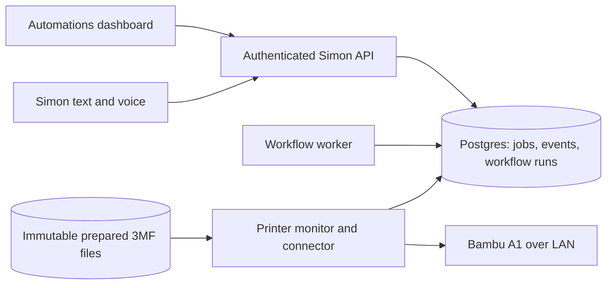

# AutoSwap RIP integration plan

Status: investigation and implementation plan, 2026-09-17. The read-only A1 monitor and a supervised AutoSwap batch pilot are now available in Automations. A live status request reported the printer idle; no print or motion command was run while implementing the pilot.

The pilot deliberately uses AutoSwap's existing SQLite queue and LAN runner as its sole print queue. Simon stores uploaded source files and prepared copies in AutoSwap's ignored `spool/`, then shows queue state through authenticated routes. This is a transitional integration for the first supervised test; the durable Postgres resource and event model below remains the target for unattended operation.

For a batch of two to eight sliced files, the bridge patches every job except the last. The first print's `FINISH` comes after its embedded swap. The runner then stops and waits for an operator to inspect plate seating in the UI before the next print. A wrong-job or missing-identity terminal report cannot advance the queue. Prepared files and SHA-256 hashes are downloadable before dispatch. A lost connection or failed command leaves the batch needing attention. No live swap result has yet been verified.

## What exists

The sibling `../autoswap_rip` project is a standalone Bambu A1 LAN print queue. `workflow.py` prepares an already sliced `.gcode.3mf`, inserts `eject_sequence.gcode` before the plate's final XYZ motor-off command, uploads the prepared archive with FTPS, starts it with MQTT, and watches MQTT status. It stores jobs in its own SQLite database and runs the queue in a foreground process. `swaptool.py` also has an older direct motion path; that path is separate from the queue and should stay out of the first integration.

The current AutoSwap database has zero jobs, so no queue history needs migrating now. Its README says no live print has been run yet. Its tests cover archive preparation, several G-code layout rejections, basic readiness checks, and a simulated `PREPARE` → `RUNNING` → `FINISH` sequence.

Simon already has authenticated, account-scoped, versioned workflows, durable runs and events, a worker heartbeat, and a basic Work view. The current worker accepts only `system.echo` and `home.inventory`; it has no printer connector, physical resource lease, telemetry wait, or printer authorization. The Home page and Simon page share the current blue and black design. `docs/workflow-automation-plan.md` already describes the broader target for printer workflows.

## Recommended boundary

Add **Automations** as a third top-level view beside Home and Simon. Put the print queue, current printer state, and all workflow runs there. Keep Simon's Work view for project context and short links to an automation or run; both views should use the same backend records.

Use Postgres as the source of truth for printer jobs, workflow links, events, and command intent. Package the useful AutoSwap code as a printer adapter and archive preparation module inside Simon, with its tests and attribution in the module header. Do not run `workflow.py run` inside a Simon workflow step or keep two active queues. A dedicated printer monitor can hold the MQTT connection and report observations while the workflow worker performs short, durable dispatch decisions.

## Print state and data

Create printer, print-artifact, print-job, printer-observation, and printer-command records. Every record needs household ownership and stable IDs. The artifact records should include source and prepared SHA-256 hashes, selected plate, swap-sequence version/hash, preparation timestamp, and storage path; store the source and prepared archives separately. The job should link to its workflow run when created by a workflow, but manual queue jobs must work without one.

Use states such as `queued`, `preparing`, `ready`, `dispatching`, `printing`, `paused`, `completed`, `failed`, `cancelled`, and `needs_attention`. Store command intent and acknowledgments separately from observed printer state. A stale or missing report means **unknown**; it must not be shown as idle or completed. Track `observed_at`, `received_at`, freshness, progress, layer, ETA if reported, temperatures, alerts, and printer connection health. Label any ETA as an estimate.

Only one dispatcher may control a printer at a time. Use a database resource lease and a connector-side dispatch lock. Record a stable job/command ID before sending `project_file`; an MQTT publish or acknowledgment timeout is an uncertain outcome, never permission to resend automatically. After a restart or disconnect, reconcile the printer's current job identity and fresh status before releasing the lease or starting another print. If identity cannot be established, leave the queue at `needs_attention` for operator resolution.

AutoSwap currently marks a job done when it sees `FINISH` after any `RUNNING` report. Its incoming status is not checked against that job's identity, and it does not persist progress reports. The integrated monitor must correlate progress and terminal reports with the intended print using the strongest identity fields available in actual A1 reports, plus the command receipt, remote filename and start window. Test the fields against a real printer before treating them as authoritative. A report from a prior, manual, or different job cannot complete the queued job.

## Critical swap decision

The current preparation method embeds the swap in **every** prepared print, including the last one. The printer's `FINISH` therefore arrives only after the embedded swap has executed. This differs from the desired workflow of deciding *between* jobs whether to cool, swap, verify the new plate, or leave the final plate in place. The present G-code also cannot pause for a dashboard decision after printing but before the swap.

For the first supervised trial, support the existing embedded-swap artifact as an explicitly labelled legacy mode and require an operator to verify the resulting plate before the next print. For unattended batches, design a distinct, bounded post-print swap step or produce a validated per-job artifact that skips the swap for the final item. Proceed only once printer positioning, cooling requirements, fixture geometry, plate seating evidence, and behavior on failure are demonstrated. A `FINISH` report alone is not evidence that the plate is seated safely.

## Automations dashboard

1. **Overview:** active prints and workflows, queue depth, items needing attention, printer and worker connection freshness. A small Home card can link here.
2. **Printer detail:** printer state, current job, percent, layer, estimated remaining time, temperatures and alerts when available, timestamp of last valid report, and a clear offline/stale state.
3. **Print queue:** selected plate, file and artifact version, AMS setting, position, state, current stage (`validate`, `upload`, `start`, `print`, `swap`, `verify`), and operator notes. Allow upload/validation and queue reordering only after the backend enforces ownership and active-job rules.
4. **Run detail:** event timeline with command intent, acknowledgment, printer observations, artifact hashes, workflow step, errors, and required intervention. Expose pause, resume, stop, and resolve with accurate descriptions of what the command does to an active print. Cancellation of a workflow must not falsely claim the printer stopped.
5. **Other workflows:** saved definitions, upcoming and active runs, history, worker health, and filters. Use the same run-detail pattern for non-print work.

The browser reads from Simon's authenticated API and never receives the printer access code. Poll initially at a bounded interval while visible; use events later if needed. Every displayed status should include its age and source. Keep the UI responsive on mobile and consistent with the existing dark blue theme.

## Delivery sequence

| Stage | Work | Acceptance gate |
| --- | --- | --- |
| 1. Observation | Add account-scoped printer configuration, a read-only MQTT monitor, persisted observations, and an Automations overview. Reuse existing workflow-run and health APIs for generic workflow cards. | A real or simulated printer disconnect appears as stale/offline; no print commands are available. |
| 2. Preparation | Move archive validation and G-code preparation into a tested Simon module. Add immutable artifacts and a preview of plate, swap mode, and hashes. Limit archive size/decompression and reject unsafe ZIP paths or unsupported G-code layouts. | Source stays unchanged; invalid archives fail before any upload; prepared output matches a reviewed fixture. |
| 3. Queue and dispatch | Add Postgres jobs, per-printer lease, command intents, FTPS upload, MQTT start, and correlated monitoring. Add queue and job detail UI. | Simulated duplicate workers, delayed acknowledgments, foreign `FINISH`, restart, and network loss never start a second print automatically. |
| 4. Supervised trial | Run one reviewed print with an operator present, inspect the prepared G-code and fixture travel, record MQTT identity fields, and verify the physical swap outcome. | Print, swap, failures, and recovery are documented with actual device evidence. |
| 5. Bounded batches | Add explicit batch grants, start windows, cooling and plate verification steps, final-plate behavior, and controlled handoff to the next job. Link these steps to Simon workflow runs. | The next job starts only after fresh completion and plate-readiness evidence; an uncertain result stops the batch. |

Stage 1 includes a live read-only printer card, automation run dashboard, and a basic step builder. The builder can create one-time scheduled runs and receipt-backed light/outlet actions. A supervised print batch queue now supports a first physical trial. Daily/weekly recurrence, conditions, branches, and unattended print dispatch remain later stages.

## Open implementation inputs before printer control

- Confirm the actual A1, fixture and plate setup, and whether the final plate should remain in place.
- Capture a real read-only MQTT status sample to identify reliable job, progress, and error fields. Do not save or log the access code.
- Decide whether plate seating can be sensed or requires an operator after each swap.
- Decide whether sliced `.gcode.3mf` files come from manual upload, a watched folder, or a later slicer workflow. Start with manual upload unless an existing, controlled source is identified.

These inputs gate live dispatch and unattended handoff, not the read-only dashboard or backend scaffolding.
