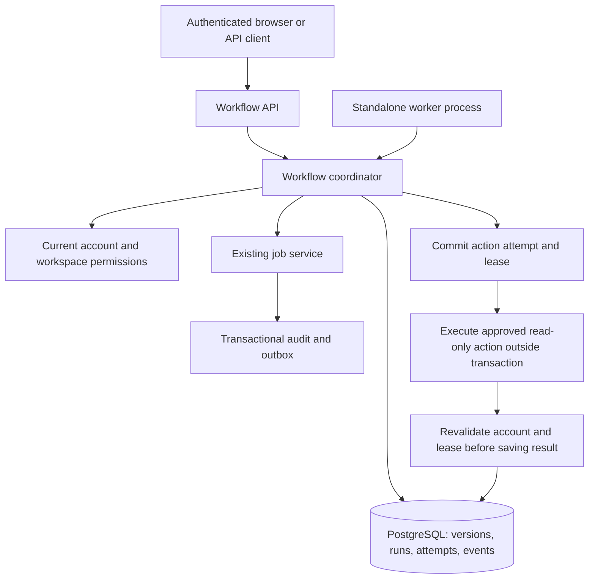

# Workflow foundation

Update September 17, 2026: Automations now has a separate dashboard, a multi-step builder,
one-time scheduled starts, and `home.set` actions for enabled devices. Device commands use
durable, stable receipts and require verified readback before a workflow step succeeds.
The A1 card reads LAN status only. Recurring schedules, condition branches, and printer
dispatch are still planned. The verification record below describes the original foundation.

Verified September 16, 2026: 486 regression tests passed with PostgreSQL and browser checks,
94.78% coverage; five optional paid model tests skipped. Ruff and strict mypy passed. Migration
0014 is applied locally, and the running development server exposes the workflow APIs. Tests
used simulated/read-only actions and disposable databases; no household devices were operated.

The first executable workflow architecture is implemented. It supports immutable definition
versions, manual and one-time starts, dependencies, timed waits, start-by deadlines, run expiry,
persisted attempts and job receipts, pause/resume/cancel, and an ordered event timeline.

Only `system.echo` and `home.inventory` action version 1 are enabled. Inventory reads saved Simon
device metadata; it neither refreshes provider state nor operates a device. The Simon Work tab
can create and run simple one-step workflows, review runs, and pause, resume, or cancel them.
Recurrence, telemetry condition waits, chat tools, a full workflow editor, physical resource
leases, and printer actions are subsequent phases. The [full workflow plan](workflow-automation-plan.md)
remains the target design.

## Architecture



Code boundaries:

| Location | Responsibility |
|---|---|
| `src/simon/domain/workflows.py` | Validated graph, definition versions, runs, steps, attempts, events |
| `src/simon/domain/ports.py` | Workflow persistence interface shared by both storage adapters |
| `src/simon/services/workflows.py` | Authorize, version, start, schedule, claim, complete, recover, control |
| `src/simon/api/workflows.py` | Authenticated API, using the same session and CSRF checks as chat |
| `src/simon/workflow_worker.py` | Independent polling process; no chat, voice, or model dependency |
| `db/migrations/0014_workflows.sql` | Durable versions, runs, event timeline, worker heartbeat |

The definition graph is a bounded DAG with unique step IDs and validated dependency references.
Version one accepts at most 25 steps and 4 KB of input per action. All dependencies must succeed
before a step becomes eligible. Independent branches are supported structurally, but this worker
executes one action at a time per run; concurrent branches and conditional joins are not enabled.
The action allowlist and version are validated in code, not supplied as executable paths or shell
commands. New tool integrations must deliberately extend the validated contract and dispatcher.

## Storage and execution decisions

- `workflow_versions` holds immutable definitions keyed by workflow ID and version. Saving an edit
  requires the expected current version. A run pins the requested version and snapshots its steps.
- `workflow_runs` stores the bounded step/attempt snapshot, optimistic version, next wake time,
  lease token, lease expiry, and worker identity. Keeping this bounded aggregate together makes
  state transitions atomic in this initial release; individual steps can be normalized later.
- `workflow_events` is an ordered timeline. State, timeline, existing job transitions, audit, and
  outbox records commit in the same transaction. Event sequence follows the run version.
- Each action attempt links an existing `Job`. A logical action is identified by run ID and step
  ID; retries have distinct attempt/job IDs. Successful steps are never restarted by recovery.
- Candidate queries use the due-time index. Claiming re-reads current state under the repository's
  identity/workspace locks and uses an expected-version write. Competing workers cannot claim the
  same live lease. Network or tool work does not run inside these transactions.
- Only the current lease token may publish a result. Lease expiry interrupts the old attempt and
  permits a fresh read-only attempt. Late responses cannot overwrite a newer attempt's result.
  Action failures back off five seconds; actions have at most three attempts. No physical write is
  currently dispatched, and the design does not promise exactly-once physical execution.
- The worker uses the run's initiating account and current membership, not a browser token. Closing
  chat or signing out does not stop an authorized run. Disabling the account or removing access
  moves the run to `needs_attention`; restoring access does not silently resume it.

Definitions, runs, and workflow action jobs are private to the initiating account within its
workspace. Other accounts, including owners in the same workspace, cannot inspect them. Definition
creation is limited to 100 per account; broader queue admission, storage quotas, and retention are
still to be added before offering general multi-user workflow hosting.

## Timing and control

`start_at`, `not_before`, `start_by`, and `expires_at` require explicit timezone offsets. Omitting
`start_at` means start now. A run must start and expire within the next 30 days; the default expiry
is seven days after its start. These are absolute-time schedules; recurring wall-clock schedules,
IANA timezone previews, and DST policies will be implemented separately.

A step's delay is relative to the latest completion of its dependencies, or the run's scheduled
start for root steps. `not_before` can push that time later. Computed wake times persist; no request
or voice call sleeps for a workflow wait. A restart catches up eligible read-only work within its
remaining deadlines. Expired work is recorded as expired/failed rather than run.

Pause prevents future dispatch while allowing an already claimed read-only action to publish its
result. A crashed attempt is reconciled when its lease expires even if paused. Resume revalidates
access and retains successful steps and original timing; elapsed delays are not reset. Parked
paused runs are checked for expiry when resumed. Cancel ends future work, records interrupted
attempts, and rejects late results. It is not an instruction to switch off hardware.

## Run the worker

Keep Simon's normal dev server running. In a second PowerShell terminal from the repository:

```powershell
.\scripts\start-workflow-worker.ps1
```

The launcher applies migrations and runs the worker against the local development PostgreSQL
database. It requires PostgreSQL to be running. Use `-DatabaseUrl` for a different database.
Stop with Ctrl+C; restarting resumes eligible pending work. `-Once` processes one batch and exits,
so a multi-step run generally needs multiple batches. The API does not run a scheduler itself.

Production/operator entry point with database environment configured:

```powershell
.\venv\Scripts\python.exe -m simon.workflow_worker
```

`GET /v1/workflows/health` reports whether a worker checked in within 45 seconds. The initial
worker has short, read-only handlers with 30-second leases. Long-running slicer/printer integrations
must use separate dispatch and monitoring steps plus appropriate heartbeat/reconciliation support.
No Windows startup task or always-on worker has been installed automatically.

## Try the demo

The body in [read-only-demo.json](../examples/workflows/read-only-demo.json) creates:

```text
Return test data -> wait 10 seconds -> read saved inventory -> done
```

For a quick authenticated test, sign in to Simon, open the browser developer console on its chat
page, and paste the following. It works locally and beneath `/simon`:

```javascript
const prefix = location.pathname.startsWith('/simon/') ? '/simon' : '';
const workflowSession = await (await fetch(prefix + '/auth/session')).json();
async function workflowPost(path, body) {
  const response = await fetch(prefix + path, {
    method: 'POST', headers: {'Content-Type': 'application/json', 'X-CSRF-Token': workflowSession.csrf_token},
    body: JSON.stringify(body)
  });
  const result = await response.json();
  if (!response.ok) throw new Error(JSON.stringify(result));
  return result;
}
const definition = await workflowPost('/v1/workflows', {
  spec: {name: 'My first workflow', steps: [
    {id: 'prepare', action: 'system.echo', inputs: {message: 'Ready'}},
    {id: 'wait', kind: 'wait', depends_on: ['prepare'], delay_seconds: 10},
    {id: 'inventory', action: 'home.inventory', depends_on: ['wait']}
  ]}, expected_version: 0, idempotency_key: crypto.randomUUID()
});
const run = await workflowPost(`/v1/workflows/${definition.id}/runs`, {
  definition_version: definition.version, idempotency_key: crypto.randomUUID()
});
console.log('Run ID:', run.id);
```

Inspect progress after the worker has processed the steps:

```javascript
await (await fetch(`${prefix}/v1/workflow-runs/${run.id}`)).json();
await (await fetch(`${prefix}/v1/workflow-runs/${run.id}/events`)).json();
```

To schedule a one-time start, include a future `start_at` ISO timestamp in the start body. To
pause/resume/cancel a nonterminal run, POST `{action, expected_version}` to
`/v1/workflow-runs/{id}/control`, using its latest version. Definition edits POST to
`/v1/workflows/{id}/versions`; GET with `?version=1` retrieves a pinned older definition.

## Next architecture increments

1. Add condition-wait records with correlated observations, freshness, timeout, and polling/event
   subscriptions. This will support monitoring without leaving a long-running action open.
2. Add recurring/event triggers, unique occurrence keys, timezone/DST handling, overlap policy,
   admission limits, and missed-trigger rules.
3. Build the Automations UI and chat tools against these API boundaries: step editor, run timeline,
   upcoming work, attention states, and control actions.
4. Add explicit standing grants and per-resource fencing before registering device writes, slicer
   jobs, or printer actions. Uncertain physical effects must reconcile instead of automatically retry.

Tests cover graph validation, immutable versions, one-time timing and waits, duplicate starts,
concurrent claims, stale leases, rollback, retries, pause/cancel, ownership, access revocation,
HTTP auth/CSRF, and separate worker processes resuming the same persisted run.
